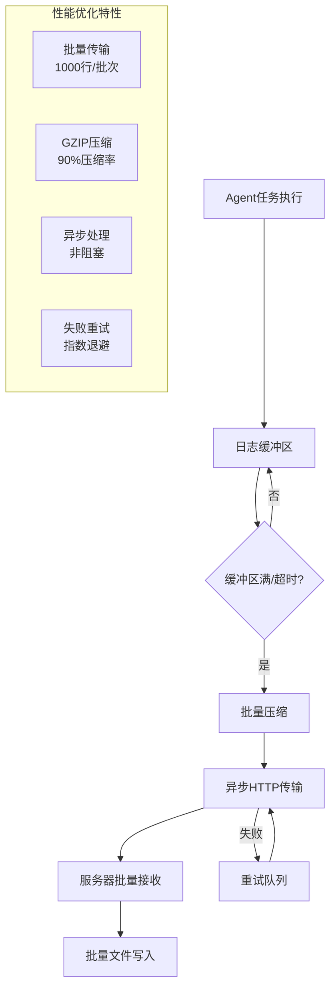
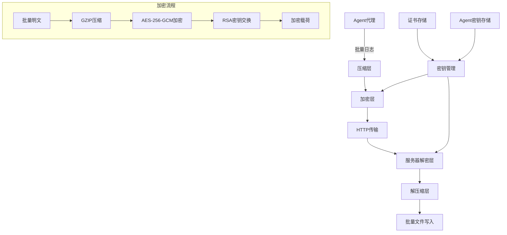
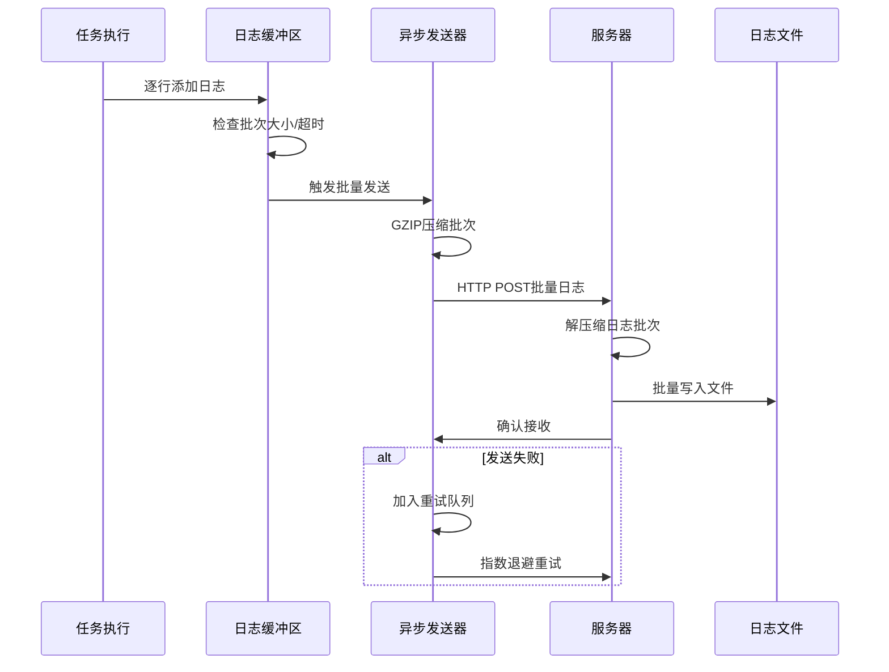
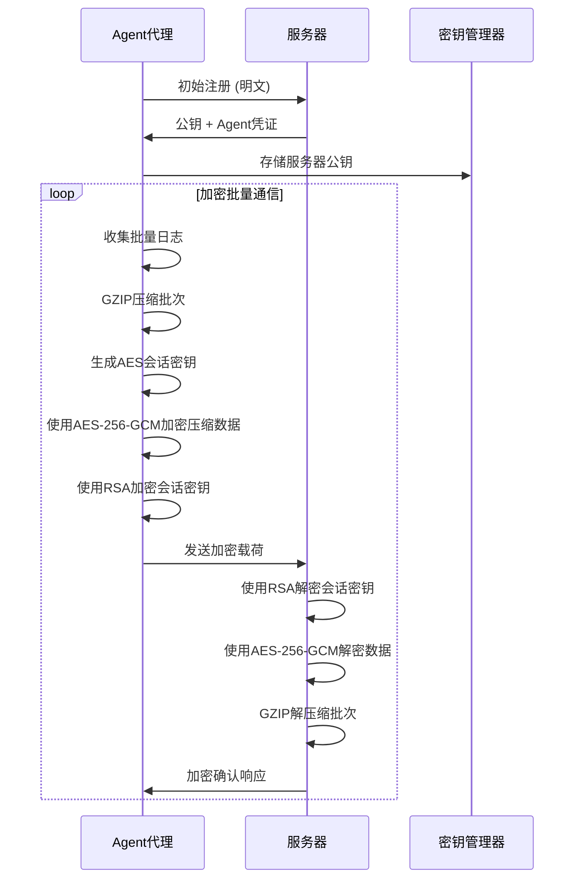

# 设计文档：Agent-服务器通信优化与加密

## 概述

本功能分两个阶段优化LightScript代理和服务器之间的通信：

**第一阶段：性能优化** - 解决当前日志上传的严重性能问题，实现批量传输、压缩、异步处理和可靠性保障，将100MB+日志的传输时间从数小时缩短到分钟级别。

**第二阶段：通信加密** - 在高效传输基础上实现端到端加密，防止安全监控软件将命令/脚本传输标记为注入攻击。使用AES-256-GCM加密配合RSA密钥交换，遵循约定大于配置的原则。

## 架构设计

### 第一阶段：性能优化架构



### 第二阶段：加密架构



## 主要算法/工作流程

### 第一阶段：批量日志上传流程



### 第二阶段：加密通信流程



## 核心接口/类型

### 第一阶段：性能优化接口

```java
// 批量日志缓冲区
class LogBuffer {
    List<LogEntry> entries;          // 日志条目列表
    int maxBatchSize;                // 最大批次大小 (默认1000)
    long maxWaitTimeMs;              // 最大等待时间 (默认5秒)
    long lastFlushTime;              // 上次刷新时间
    
    void addLog(String stream, String data);
    boolean shouldFlush();
    List<LogEntry> flush();
}

// 批量日志请求
class BatchLogRequest {
    String agentId;
    String agentToken;
    Long executionId;
    List<LogEntry> logs;             // 批量日志条目
    boolean compressed;              // 是否压缩
    String compressionType;          // 压缩类型 (gzip)
}

// 日志条目
class LogEntry {
    int seq;                         // 序列号
    String stream;                   // 流类型 (stdout/stderr/system)
    String data;                     // 日志内容
    long timestamp;                  // 时间戳
}

// 异步日志发送器
class AsyncLogSender {
    ExecutorService executor;        // 异步执行器
    Queue<BatchLogRequest> retryQueue; // 重试队列
    
    CompletableFuture<Void> sendBatch(BatchLogRequest request);
    void scheduleRetry(BatchLogRequest request, int attempt);
}
```

### 第二阶段：加密接口扩展

```java
// 加密服务接口
interface EncryptionService {
    EncryptedPayload encrypt(byte[] data, String recipientPublicKey);
    byte[] decrypt(EncryptedPayload payload, String privateKey);
    KeyPair generateKeyPair();
    boolean validateSignature(byte[] data, String signature, String publicKey);
}

// 加密批量日志请求
class EncryptedBatchLogRequest extends BatchLogRequest {
    String encryptedData;            // AES-256-GCM加密的压缩日志
    String encryptedKey;             // RSA加密的AES密钥
    String iv;                       // AES初始化向量
    String authTag;                  // GCM认证标签
    String signature;                // RSA完整性签名
    long timestamp;                  // 重放攻击防护
}

// Agent加密上下文
class AgentEncryptionContext {
    String agentId;                  // Agent标识
    String serverPublicKey;          // 服务器公钥
    String agentPrivateKey;          // Agent私钥
    String agentPublicKey;           // Agent公钥
    long keyRotationTime;            // 密钥轮换时间
}
```

## 关键函数及正式规范

### 第一阶段：性能优化函数

#### 函数1: batchSendLogs()

```java
CompletableFuture<Void> batchSendLogs(List<LogEntry> logBatch, Long executionId)
```

**前置条件:**
- `logBatch` 非空且大小在1-1000之间
- `executionId` 是有效的任务执行ID
- Agent认证信息有效

**后置条件:**
- 返回异步完成的Future对象
- 日志批次被压缩并发送到服务器
- 发送失败时自动加入重试队列
- 不阻塞任务执行线程

**循环不变式:** 重试队列中的批次按失败时间排序

#### 函数2: compressLogBatch()

```java
byte[] compressLogBatch(List<LogEntry> logBatch)
```

**前置条件:**
- `logBatch` 包含有效的日志条目
- 每个LogEntry的data字段非null

**后置条件:**
- 返回GZIP压缩的字节数组
- 压缩率通常达到85-95%
- 压缩后数据可被标准GZIP解压

**循环不变式:** 无（压缩是原子操作）

### 第二阶段：加密函数

#### 函数3: encryptBatchData()

```java
EncryptedPayload encryptBatchData(byte[] compressedData, String serverPublicKey)
```

**前置条件:**
- `compressedData` 是有效的压缩日志数据
- `serverPublicKey` 是有效的RSA-2048公钥，PEM格式
- 当前系统时间可用于时间戳生成

**后置条件:**
- 返回包含所有必需字段的有效EncryptedPayload
- `encryptedData` 包含AES-256-GCM加密的压缩内容
- `encryptedKey` 包含RSA加密的AES会话密钥
- `signature` 提供完整性验证
- `timestamp` 防止重放攻击（5分钟时间窗口内）

**循环不变式:** 无（加密过程中无循环）

#### 函数4: decryptBatchData()

```java
byte[] decryptBatchData(EncryptedPayload payload, String privateKey)
```

**前置条件:**
- `payload` 是格式良好的EncryptedPayload对象
- `privateKey` 是有效的RSA-2048私钥，与加密公钥匹配
- `payload.timestamp` 在可接受的时间窗口内（5分钟）

**后置条件:**
- 返回解密的压缩数据字节数组
- 如果签名验证失败则抛出SecurityException
- 如果时间戳超出有效窗口则抛出SecurityException
- 对输入参数无副作用

**循环不变式:** 无（解密过程中无循环）

## 算法伪代码

### 第一阶段：批量日志上传算法

```pascal
算法 batchLogUpload(executionId, logStream)
输入: executionId 类型为Long, logStream 类型为InputStream
输出: 无 (异步处理)

开始
  buffer ← 创建LogBuffer(maxSize=1000, maxWaitMs=5000)
  sender ← 创建AsyncLogSender()
  
  // 主处理循环
  当 logStream.hasNext() 执行
    logLine ← logStream.readLine()
    如果 logLine ≠ null 那么
      buffer.addLog("stdout", logLine)
      
      // 检查是否需要刷新缓冲区
      如果 buffer.shouldFlush() 那么
        logBatch ← buffer.flush()
        
        // 异步发送批次
        future ← sender.sendBatch(executionId, logBatch)
        future.exceptionally(ex -> {
          // 失败时加入重试队列
          sender.scheduleRetry(logBatch, 1)
          返回 null
        })
      结束如果
    结束如果
  结束当
  
  // 处理剩余日志
  如果 buffer.hasLogs() 那么
    finalBatch ← buffer.flush()
    sender.sendBatch(executionId, finalBatch).join() // 等待最后批次完成
  结束如果
结束

算法 sendBatchWithCompression(logBatch)
输入: logBatch 类型为List<LogEntry>
输出: success 类型为boolean

开始
  // 序列化日志批次
  jsonData ← serializeToJson(logBatch)
  
  // GZIP压缩
  compressedData ← gzipCompress(jsonData)
  compressionRatio ← compressedData.length / jsonData.length
  
  // 构建HTTP请求
  request ← 创建HttpPost("/api/agent/tasks/executions/" + executionId + "/batch-log")
  request.setHeader("Content-Type", "application/json")
  request.setHeader("Content-Encoding", "gzip")
  request.setHeader("X-Batch-Size", logBatch.size())
  request.setEntity(compressedData)
  
  // 发送请求
  response ← httpClient.execute(request)
  
  如果 response.statusCode = 200 那么
    返回 true
  否则
    记录错误("批量日志发送失败: " + response.statusCode)
    返回 false
  结束如果
结束
```

**前置条件:**
- logStream包含要上传的日志数据
- executionId是有效的任务执行标识
- Agent认证信息已配置且有效
- 网络连接可用

**后置条件:**
- 所有日志数据被批量上传到服务器
- 失败的批次自动重试（最多3次）
- 不阻塞任务执行主线程
- 上传完成后清理缓冲区资源

**循环不变式:**
- buffer.size() ≤ maxBatchSize
- 重试队列中的批次按失败时间排序
- 已发送的日志序列号单调递增

### 第二阶段：加密批量上传算法

```pascal
算法 encryptedBatchUpload(logBatch, serverPublicKey)
输入: logBatch 类型为List<LogEntry>, serverPublicKey 类型为String
输出: success 类型为boolean

开始
  断言 logBatch ≠ null 且 serverPublicKey ≠ null
  
  // 步骤1: 序列化和压缩
  jsonData ← serializeToJson(logBatch)
  compressedData ← gzipCompress(jsonData)
  
  // 步骤2: 生成会话密钥并加密数据
  sessionKey ← generateAESKey(256)
  iv ← generateRandomIV(12)
  
  encryptedData ← encryptAES_GCM(compressedData, sessionKey, iv)
  authTag ← extractAuthTag(encryptedData)
  
  // 步骤3: 使用RSA加密会话密钥
  encryptedKey ← encryptRSA(sessionKey, serverPublicKey)
  
  // 步骤4: 创建完整性签名
  signatureData ← concatenate(encryptedData, encryptedKey, iv, timestamp)
  signature ← signRSA(signatureData, agentPrivateKey)
  
  // 步骤5: 构建加密载荷
  payload ← EncryptedBatchLogRequest{
    encryptedData: encryptedData,
    encryptedKey: encryptedKey,
    iv: iv,
    authTag: authTag,
    signature: signature,
    timestamp: getCurrentTimestamp(),
    batchSize: logBatch.size()
  }
  
  断言 payload.isComplete() 且 payload.isValid()
  
  // 步骤6: 发送加密请求
  request ← createEncryptedRequest(payload, "/api/agent/tasks/executions/" + executionId + "/encrypted-batch-log")
  response ← httpClient.execute(request)
  
  返回 response.statusCode = 200
结束
```

**前置条件:**
- logBatch包含要加密上传的日志条目
- serverPublicKey是有效的RSA公钥
- Agent加密上下文已正确初始化
- 系统时间已同步

**后置条件:**
- 日志批次被压缩、加密并安全传输
- 服务器可以验证数据完整性和真实性
- 防止重放攻击和中间人攻击
- 监控软件无法识别传输内容

**循环不变式:** 无（加密是原子操作序列）

## 使用示例

### 第一阶段：批量日志上传示例

```java
// Agent端批量日志收集和发送
public class BatchLogCollector {
    private final LogBuffer buffer = new LogBuffer(1000, 5000); // 1000条或5秒
    private final AsyncLogSender sender = new AsyncLogSender();
    
    public void collectLog(String stream, String data) {
        buffer.addLog(stream, data);
        
        if (buffer.shouldFlush()) {
            List<LogEntry> batch = buffer.flush();
            
            // 异步发送，不阻塞任务执行
            sender.sendBatch(executionId, batch)
                .exceptionally(ex -> {
                    log.warn("批量日志发送失败，加入重试队列: {}", ex.getMessage());
                    sender.scheduleRetry(batch, 1);
                    return null;
                });
        }
    }
}

// 服务器端批量日志接收
@PostMapping("/api/agent/tasks/executions/{executionId}/batch-log")
public ResponseEntity<Void> receiveBatchLog(
        @PathVariable Long executionId,
        @RequestBody BatchLogRequest request,
        @RequestHeader(value = "Content-Encoding", required = false) String encoding) {
    
    if (!agentService.validateAgent(request.getAgentId(), request.getAgentToken())) {
        return ResponseEntity.status(403).build();
    }
    
    try {
        // 处理压缩数据
        List<LogEntry> logs = request.getLogs();
        if ("gzip".equals(encoding)) {
            // 数据已在HTTP层自动解压
        }
        
        // 批量写入日志文件
        taskService.appendBatchLogs(executionId, logs);
        return ResponseEntity.ok().build();
        
    } catch (Exception e) {
        log.error("批量日志处理失败", e);
        return ResponseEntity.status(500).build();
    }
}
```

### 第二阶段：加密批量上传示例

```java
// Agent端加密批量发送
public class EncryptedBatchLogSender {
    private final EncryptionService encryptionService;
    private final String serverPublicKey;
    
    public CompletableFuture<Void> sendEncryptedBatch(List<LogEntry> logBatch) {
        return CompletableFuture.supplyAsync(() -> {
            try {
                // 1. 序列化和压缩
                String jsonData = objectMapper.writeValueAsString(logBatch);
                byte[] compressedData = gzipCompress(jsonData.getBytes());
                
                // 2. 加密压缩数据
                EncryptedPayload payload = encryptionService.encrypt(compressedData, serverPublicKey);
                
                // 3. 发送加密请求
                HttpPost request = new HttpPost(baseUrl + "/api/agent/tasks/executions/" + executionId + "/encrypted-batch-log");
                request.setHeader("Content-Type", "application/json");
                request.setEntity(new StringEntity(objectMapper.writeValueAsString(payload)));
                
                try (CloseableHttpResponse response = httpClient.execute(request)) {
                    if (response.getStatusLine().getStatusCode() != 200) {
                        throw new RuntimeException("加密日志发送失败: " + response.getStatusLine());
                    }
                }
                return null;
                
            } catch (Exception e) {
                throw new RuntimeException("加密批量发送失败", e);
            }
        });
    }
}

// 服务器端解密批量接收
@PostMapping("/api/agent/tasks/executions/{executionId}/encrypted-batch-log")
public ResponseEntity<Void> receiveEncryptedBatchLog(
        @PathVariable Long executionId,
        @RequestBody EncryptedBatchLogRequest request) {
    
    try {
        // 1. 解密数据
        byte[] decryptedData = encryptionService.decrypt(request, serverPrivateKey);
        
        // 2. 解压缩
        String jsonData = gzipDecompress(decryptedData);
        
        // 3. 反序列化日志批次
        List<LogEntry> logs = objectMapper.readValue(jsonData, 
            new TypeReference<List<LogEntry>>() {});
        
        // 4. 批量写入
        taskService.appendBatchLogs(executionId, logs);
        
        return ResponseEntity.ok().build();
        
    } catch (SecurityException e) {
        log.warn("加密日志安全验证失败: {}", e.getMessage());
        return ResponseEntity.status(403).build();
    } catch (Exception e) {
        log.error("加密批量日志处理失败", e);
        return ResponseEntity.status(500).build();
    }
}
```

## 正确性属性

*属性是在系统所有有效执行中都应成立的特征或行为，是连接人类可读规范与机器可验证正确性保证的桥梁。*

### 属性 1：批量传输完整性

*对于任意* 日志批次和有效的 ExecutionId，当批量发送成功时，服务器接收到的日志条目数量应等于发送批次中的条目数量。

**验证需求：需求 1.2、1.4**

### 属性 2：GZIP 压缩往返正确性

*对于任意* 有效的日志批次数据，将其序列化后进行 GZIP 压缩，再解压缩，应得到与原始序列化数据完全相同的内容。

**验证需求：需求 2.4**

### 属性 3：失败批次进入重试队列

*对于任意* 发送失败的日志批次，只要其重试次数未超过最大值（3次），该批次应出现在 RetryQueue 中等待重试。

**验证需求：需求 4.1、4.2**

### 属性 4：AES-256-GCM 加密往返正确性

*对于任意* 有效的压缩日志数据和匹配的 RSA-2048 密钥对，对数据进行 AES-256-GCM 加密后再解密，应得到与原始压缩数据完全相同的内容。

**验证需求：需求 5.4**

### 属性 5：RSA 密钥交换往返正确性

*对于任意* 有效的 RSA-2048 密钥对，使用公钥加密任意 AES SessionKey 后，再用对应私钥解密，应还原原始 SessionKey。

**验证需求：需求 6.3**

### 属性 6：数字签名验证一致性

*对于任意* 有效的 RSA-2048 密钥对和任意数据，使用私钥签名后用对应公钥验证应返回 true；对签名后的数据进行任意修改，验证应返回 false。

**验证需求：需求 7.4**

### 属性 7：重放攻击防护边界

*对于任意* 时间戳超出当前时间 5 分钟窗口的 EncryptedPayload，服务器解密处理应抛出 SecurityException 并拒绝请求。

**验证需求：需求 8.2、8.3**

### 属性 8：压缩加密组合往返正确性

*对于任意* 有效的日志批次，经过序列化→GZIP 压缩→AES-256-GCM 加密→RSA 密钥加密的完整流程，再经过 RSA 密钥解密→AES-256-GCM 解密→GZIP 解压缩→反序列化，应还原与原始日志批次等价的内容。

**验证需求：需求 5.4、6.3、2.4**

### 属性 9：加密开关路由正确性

*对于任意* Agent 配置，当 `encryption.enabled=false` 时所有日志批次应通过非加密端点发送；当 `encryption.enabled=true` 时所有日志批次应通过加密端点发送。

**验证需求：需求 11.1、11.2**

## 错误处理

### 第一阶段：性能优化错误处理

#### 错误场景1: 批量发送失败

**条件**: 网络中断或服务器临时不可用导致批量日志发送失败
**响应**: 将失败批次加入重试队列，使用指数退避策略重试
**恢复**: 最多重试3次，重试间隔为1s、2s、4s，最终失败则记录到本地文件

#### 错误场景2: 压缩失败

**条件**: 日志数据包含无法压缩的二进制内容或内存不足
**响应**: 降级为不压缩传输，记录警告日志
**恢复**: 继续正常的批量传输流程，但不启用压缩

#### 错误场景3: 缓冲区溢出

**条件**: 日志产生速度超过网络传输速度，缓冲区达到最大限制
**响应**: 强制刷新当前缓冲区，临时增加批次大小
**恢复**: 动态调整批次大小和刷新频率以适应网络条件

#### 错误场景4: 服务器批量处理失败

**条件**: 服务器磁盘空间不足或文件写入权限问题
**响应**: 返回HTTP 507或500错误，Agent收到后暂停日志上传
**恢复**: Agent等待30秒后重试，连续失败则降级为单条发送模式

### 第二阶段：加密错误处理

#### 错误场景5: 加密密钥失效

**条件**: Agent尝试使用过期或损坏的服务器公钥加密批量数据
**响应**: 抛出CryptographicException，触发密钥更新流程
**恢复**: Agent重新注册获取新的服务器公钥，重新加密并发送批次

#### 错误场景6: 批量签名验证失败

**条件**: 服务器收到加密批量载荷但签名验证失败
**响应**: 返回HTTP 403 Forbidden，记录安全事件
**恢复**: Agent检测到403错误后重新生成密钥对并重新注册

#### 错误场景7: 批量解密失败

**条件**: 服务器无法解密接收到的批量日志数据
**响应**: 返回HTTP 400 Bad Request，保留原始加密数据用于调试
**恢复**: Agent重试一次，失败则回退到单条加密传输模式

#### 错误场景8: 时间戳验证失败

**条件**: 批量加密载荷的时间戳超出5分钟有效窗口
**响应**: 拒绝请求并返回SecurityException
**恢复**: Agent同步系统时间，重新生成时间戳并重发批次

## 测试策略

### 第一阶段：性能优化测试

#### 单元测试方法

**批量处理测试**:
- 测试不同大小的日志批次（1-1000条）的处理正确性
- 验证GZIP压缩和解压缩的往返一致性
- 测试异步发送器的并发安全性

**压缩效率测试**:
- 使用真实日志数据验证压缩率达到85-95%
- 测试不同类型日志内容的压缩效果
- 验证压缩失败时的降级处理

#### 性能测试方法

**大文件传输测试**:
- 100MB日志文件传输时间对比（当前vs批量）
- 网络带宽利用率测试
- 内存使用峰值监控

**并发压力测试**:
- 多个Agent同时上传大量日志的服务器处理能力
- 重试队列在高负载下的表现
- 文件I/O并发写入性能

#### 可靠性测试

**网络故障模拟**:
- 间歇性网络中断时的重试机制
- 高延迟网络环境下的超时处理
- 带宽限制下的自适应批次大小调整

### 第二阶段：加密安全测试

#### 单元测试方法

使用已知测试向量测试批量数据的加密/解密函数，验证AES-256-GCM和RSA-2048实现符合标准测试用例，验证各种批次大小的签名生成和验证。

#### 基于属性的测试方法

**属性测试库**: JUnit 5配合Java QuickCheck

**要测试的关键属性**:
- 批量日志数据的加密/解密往返正确性
- 不同批次大小的签名验证一致性
- 时间戳验证边界条件
- 压缩+加密组合操作的数据完整性

#### 安全渗透测试

**重放攻击测试**:
- 捕获加密批量请求并尝试重放
- 修改时间戳测试验证机制
- 批量请求的顺序重排攻击

**中间人攻击测试**:
- 尝试修改传输中的加密载荷
- 签名伪造攻击测试
- 密钥交换过程的安全性验证

### 集成测试方法

#### 端到端测试

真实agent-服务器通信的端到端测试，大日志载荷的性能测试，加密通信期间的网络故障模拟，多agent的密钥轮换场景。

#### 兼容性测试

**向后兼容性**:
- 新版本Agent与旧版本服务器的通信
- 加密功能启用前后的平滑切换
- 批量模式与单条模式的混合使用

**平台兼容性**:
- Windows/Linux/macOS平台的加密性能对比
- 不同JVM版本的加密算法兼容性
- 网络环境差异对批量传输的影响

## 性能考虑

### 第一阶段：批量传输性能提升

**传输效率提升**:
- 批量传输将HTTP请求数量减少99.9%（从200万次降至2000次）
- GZIP压缩将数据传输量减少85-95%
- 100MB日志传输时间从数小时缩短至2-5分钟

**资源使用优化**:
- Agent内存使用：批量缓冲区占用约10-50MB（可配置）
- 服务器I/O优化：批量写入减少磁盘操作99.9%
- 网络连接复用：减少TCP连接建立/断开开销

**异步处理优势**:
- 任务执行不再被日志上传阻塞
- 日志发送失败不影响任务完成状态
- 支持离线缓存，网络恢复后自动同步

### 第二阶段：加密性能影响

**加密开销分析**:
- AES-256-GCM批量加密：每MB数据增加约10-20ms延迟
- RSA密钥交换开销：每批次增加约5ms（相比单条传输节省99%）
- 总体加密开销：批量模式下仅增加2-5%的传输时间

**内存使用**:
- 加密过程临时内存：约为原始数据的1.5倍
- 密钥存储：每Agent约2KB（RSA密钥对）
- 加密缓存：会话密钥复用减少重复计算

**CPU使用**:
- 批量压缩：CPU使用率增加10-15%
- 批量加密：CPU使用率增加15-25%
- 总体影响：在现代多核CPU上影响可忽略

## 安全考虑

### 第一阶段：传输安全基础

**数据完整性**:
- HTTP层面的传输完整性保证
- 批量数据的校验和验证
- 重传机制确保数据不丢失

**可用性保障**:
- 重试机制防止临时网络故障导致数据丢失
- 降级策略确保在极端情况下仍可传输
- 本地缓存防止Agent重启时数据丢失

### 第二阶段：端到端加密安全

**加密强度**:
- 使用行业标准AES-256-GCM对称加密（NIST推荐）
- RSA-2048密钥交换（符合当前安全标准）
- 会话密钥每批次更新，提供前向安全性

**攻击防护**:
- 时间戳验证防止重放攻击（5分钟窗口）
- 数字签名确保消息完整性和真实性
- 密钥轮换机制（30天周期）防止长期密钥泄露

**监控软件规避**:
- 加密后的数据对监控软件完全不透明
- 无法识别脚本、命令或敏感日志内容
- 消除误报注入攻击的可能性

**密钥管理安全**:
- 密钥使用平台特定安全存储（Java KeyStore）
- 私钥永不通过网络传输
- 公钥通过安全注册流程分发

## 依赖项

### 第一阶段：性能优化依赖

**Java标准库**:
- `java.util.concurrent` - 异步处理和线程池
- `java.util.zip.GZIPOutputStream/GZIPInputStream` - 数据压缩
- `java.nio.file` - 高效文件I/O操作

**第三方库**:
- Apache HttpClient 4.5+ - HTTP连接池和重试机制
- Jackson 2.x - JSON序列化/反序列化
- SLF4J + Logback - 日志记录

### 第二阶段：加密功能依赖

**加密库**:
- Java加密扩展(JCE) - AES-256-GCM实现
- Bouncy Castle Provider 1.70+ - RSA操作和高级加密功能
- Java KeyStore - 平台特定密钥安全存储

**网络传输**:
- Apache HttpClient - 支持自定义加密头和载荷
- Jackson JSON - 加密载荷序列化

**系统要求**:
- Java 8+ - 支持现代加密算法
- 足够的熵源 - 安全随机数生成
- 系统时间同步 - 时间戳验证准确性

## 实施计划

### 第一阶段：性能优化实施（预计2-3周）✅ 已完成

**Week 1: 核心批量传输** ✅
- 实现LogBuffer和BatchLogRequest类
- 开发Agent端批量收集逻辑
- 实现服务器端批量接收API

**Week 2: 压缩和异步处理** ✅
- 集成GZIP压缩/解压缩
- 实现AsyncLogSender异步发送器
- 开发重试队列和指数退避机制

**Week 3: 测试和优化** ✅
- 性能测试和调优
- 错误处理和边界情况测试
- 向后兼容性验证

### 第二阶段：加密功能实施（预计3-4周）🚧 进行中

**Week 4: 加密基础设施** ✅ 已完成
- 实现EncryptionService接口
- 开发密钥生成和管理功能
- 集成AES-256-GCM和RSA-2048加密算法

**Week 5: 批量加密集成** ✅ 已完成
- 扩展批量传输支持加密
- 实现EncryptedBatchLogRequest
- 开发Agent端加密批量收集器

**Week 6: 安全功能完善** ✅ 已完成
- 实现时间戳验证和重放攻击防护 ✅
- 开发密钥轮换机制 ✅
- 集成数字签名验证 ✅
- 实现服务器端解密处理 ✅

**Week 7: 安全测试和部署** 🚧 进行中
- 安全渗透测试 📋 待测试
- 性能影响评估 📋 待测试
- 生产环境部署和监控 📋 待部署

### 配置管理

**Agent配置项**:
```properties
# 批量传输配置
log.batch.size=1000
log.batch.timeout=5000
log.compression.enabled=true
log.async.enabled=true
log.retry.max=3

# 加密配置（第二阶段）✅ 已实现
encryption.enabled=false
encryption.key.rotation.days=30
encryption.algorithm=AES-256-GCM
```

**服务器配置项**:
```yaml
lightscript:
  log:
    batch:
      enabled: true
      max-size: 1000
      max-request-size: 10MB
    compression:
      enabled: true
      types: [gzip]
  encryption:
    enabled: false
    key-rotation-days: 30
    max-time-skew: 300000  # 5分钟
```

## 第二阶段实施状态

### ✅ 已完成的组件

**Agent端加密组件**:
- `EncryptionService.java` - 核心加密服务，支持AES-256-GCM和RSA-2048
- `AgentEncryptionContext.java` - 密钥管理和轮换
- `EncryptedBatchLogRequest.java` - 加密批量日志请求模型
- `EncryptedBatchLogCollector.java` - 加密批量日志收集器
- `SimpleTaskRunner.java` - 集成加密模式支持

**配置和管理**:
- `AgentConfig.java` - 加密配置读取支持
- `agent.properties` - 加密配置项
- 密钥文件安全存储（用户目录，权限保护）

### 🔄 待完成的组件

**密钥交换流程**:
- Agent注册时的公钥交换 ✅ 已实现（通过HTTP头传输）
- 服务器公钥分发机制 🔄 待完善
- 密钥轮换通知和同步 🔄 待完善

### ✅ 新增完成的组件

**服务器端解密支持**:
- `EncryptionService.java` - 服务器端加密服务 ✅
- `ServerEncryptionContext.java` - 服务器密钥管理和Agent公钥存储 ✅
- `EncryptedBatchLogRequest.java` - 服务器端加密请求模型 ✅
- `/api/agent/tasks/executions/{id}/encrypted-batch-log` 端点 ✅
- 加密批量日志解密和处理逻辑 ✅
- Agent公钥注册和管理 ✅

**配置和集成**:
- `application.yml` - 服务器端加密配置 ✅
- `AgentController.java` - 加密端点集成 ✅
- GZIP解压缩支持 ✅
- 安全验证（时间戳、签名、公钥） ✅

### 🧪 测试验证

创建了多个测试脚本：
- `test-encryption-phase2.sh` - Agent端加密功能测试 ✅
- `test-end-to-end-encryption.sh` - 端到端加密通信测试 ✅

验证内容：
- ✅ 加密服务基础功能
- ✅ 密钥生成和PEM格式转换
- ✅ AES-256-GCM加密/解密往返
- ✅ RSA签名生成和验证
- ✅ 时间戳验证和重放攻击防护
- ✅ Agent加密上下文管理
- ✅ 配置读取和密钥文件生成
- ✅ 服务器端解密处理
- ✅ Agent公钥注册和验证
- ✅ 端到端加密通信流程
- 📋 性能对比测试（明文vs加密）
- 📋 安全渗透测试