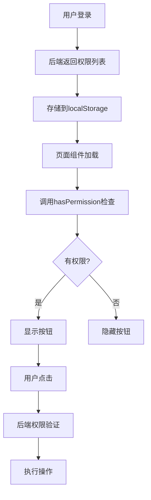
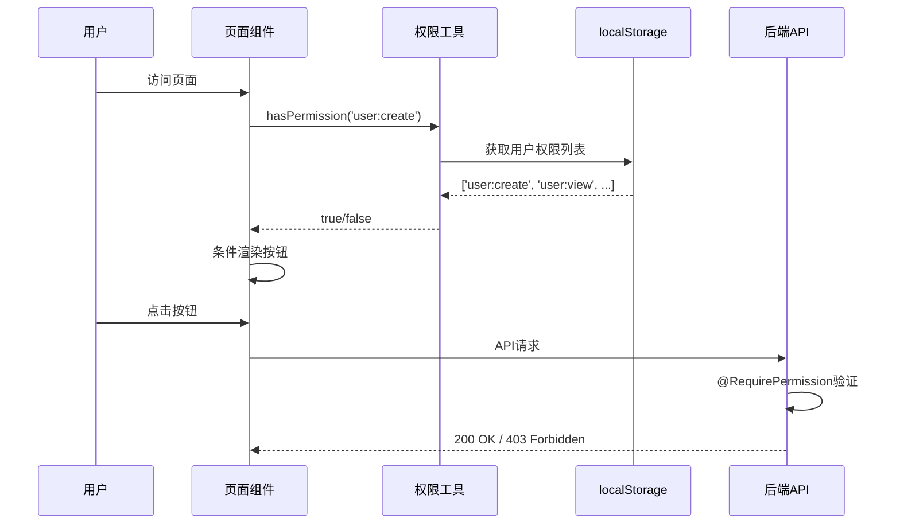

# 设计文档：前端按钮权限控制

## 概述

本设计文档描述前端按钮权限控制功能的完整技术方案。该功能基于已完成的后端权限注解和前端权限工具函数，实现根据用户权限动态显示/隐藏操作按钮，提升用户体验，避免用户点击无权限按钮后才收到403错误。

核心目标：
- 根据用户权限动态控制按钮可见性
- 改造4个核心页面（Users、Tasks、AgentGroups、Sidebar）
- 保持代码简洁，最小化改动
- 确保权限检查逻辑与后端一致

## 整体架构




## 权限检查流程



## 核心组件和接口

### 1. 权限工具函数（已完成）

**位置**：`web-modern/src/utils/permission.js`

**接口定义**：

```javascript
// 获取当前用户权限列表
function getUserPermissions(): string[]

// 检查单个权限
function hasPermission(permission: string): boolean

// 检查是否拥有任意一个权限
function hasAnyPermission(permissions: string[]): boolean

// 检查是否拥有所有权限
function hasAllPermissions(permissions: string[]): boolean

// 获取当前用户信息
function getCurrentUser(): object | null

// 检查是否已登录
function isLoggedIn(): boolean
```

**职责**：
- 从localStorage读取用户权限
- 提供权限检查方法
- 处理权限数据解析异常


### 2. 权限按钮组件（可选封装）

**位置**：`web-modern/src/components/PermissionButton.jsx`

**接口定义**：

```javascript
interface PermissionButtonProps {
  permission: string | string[]  // 所需权限
  requireAll?: boolean           // 是否需要所有权限（默认false）
  children: ReactNode            // 按钮内容
  fallback?: ReactNode           // 无权限时显示的内容（可选）
  ...buttonProps                 // 其他Button属性
}
```

**实现示例**：

```javascript
import React from 'react'
import { Button } from 'antd'
import { hasPermission, hasAllPermissions, hasAnyPermission } from '../utils/permission'

const PermissionButton = ({ 
  permission, 
  requireAll = false, 
  children, 
  fallback = null,
  ...buttonProps 
}) => {
  // 权限检查逻辑
  let hasAccess = false
  
  if (Array.isArray(permission)) {
    hasAccess = requireAll 
      ? hasAllPermissions(permission) 
      : hasAnyPermission(permission)
  } else {
    hasAccess = hasPermission(permission)
  }
  
  // 无权限时返回fallback或null
  if (!hasAccess) {
    return fallback
  }
  
  // 有权限时渲染按钮
  return <Button {...buttonProps}>{children}</Button>
}

export default PermissionButton
```

**使用示例**：

```javascript
// 单个权限
<PermissionButton permission="user:create" type="primary" icon={<PlusOutlined />}>
  创建用户
</PermissionButton>

// 多个权限（任意一个）
<PermissionButton permission={['user:edit', 'user:delete']}>
  编辑
</PermissionButton>

// 多个权限（全部需要）
<PermissionButton permission={['user:edit', 'user:view']} requireAll>
  高级编辑
</PermissionButton>

// 无权限时显示禁用按钮
<PermissionButton 
  permission="user:delete" 
  fallback={<Button disabled>删除</Button>}
>
  删除
</PermissionButton>
```


## 权限映射表

| 功能模块 | 操作 | 权限代码 | 后端注解位置 |
|---------|------|---------|-------------|
| 用户管理 | 查看列表 | user:view | UserController.getUsers() |
| 用户管理 | 创建用户 | user:create | UserController.createUser() |
| 用户管理 | 编辑用户 | user:edit | UserController.updateUser() |
| 用户管理 | 删除用户 | user:delete | UserController.deleteUser() |
| 用户管理 | 重置密码 | user:edit | UserController.resetPassword() |
| 用户管理 | 切换状态 | user:edit | UserController.toggleStatus() |
| 任务管理 | 查看列表 | task:view | TaskController.getTasks() |
| 任务管理 | 创建任务 | task:create | TaskController.createTask() |
| 任务管理 | 启动任务 | task:execute | TaskController.startTask() |
| 任务管理 | 停止任务 | task:execute | TaskController.stopTask() |
| 任务管理 | 重启任务 | task:execute | TaskController.restartTask() |
| 任务管理 | 查看详情 | task:view | TaskController.getTaskDetail() |
| 任务管理 | 查看日志 | task:view | TaskController.getExecutionLogs() |
| Agent分组 | 查看列表 | agent:group | AgentGroupController.getGroups() |
| Agent分组 | 创建分组 | agent:group | AgentGroupController.createGroup() |
| Agent分组 | 编辑分组 | agent:group | AgentGroupController.updateGroup() |
| Agent分组 | 删除分组 | agent:group | AgentGroupController.deleteGroup() |
| Agent分组 | 添加成员 | agent:group | AgentGroupController.addAgents() |
| Agent分组 | 移除成员 | agent:group | AgentGroupController.removeAgents() |
| 侧边栏 | 用户管理菜单 | user:view | - |
| 侧边栏 | Agent分组菜单 | agent:group | - |


## 页面改造方案

### 1. Users.jsx - 用户管理页面

**需要改造的按钮**：

| 按钮位置 | 按钮名称 | 所需权限 | 改造方式 |
|---------|---------|---------|---------|
| 页面头部 | 创建用户 | user:create | 条件渲染 |
| 表格操作列 | 编辑 | user:edit | 条件渲染 |
| 表格操作列 | 重置密码 | user:edit | 条件渲染 |
| 表格操作列 | 启用/禁用 | user:edit | 条件渲染 |
| 表格操作列 | 删除 | user:delete | 条件渲染 |

**代码实现**：

```javascript
import { hasPermission } from '../utils/permission'

const Users = () => {
  // ... 现有代码 ...
  
  return (
    <div className="bg-white rounded-lg shadow p-6">
      <div className="flex justify-between items-center mb-6">
        <h2 className="text-2xl font-bold">用户管理</h2>
        {hasPermission('user:create') && (
          <Button
            type="primary"
            icon={<PlusOutlined />}
            onClick={handleCreate}
          >
            创建用户
          </Button>
        )}
      </div>

      <Table
        columns={columns}
        dataSource={users}
        rowKey="id"
        loading={loading}
      />
    </div>
  )
}

// 表格列定义中的操作列
const columns = [
  // ... 其他列 ...
  {
    title: '操作',
    key: 'action',
    render: (_, record) => (
      <Space>
        {hasPermission('user:edit') && (
          <Button
            type="link"
            icon={<EditOutlined />}
            onClick={() => handleEdit(record)}
          >
            编辑
          </Button>
        )}
        {hasPermission('user:edit') && (
          <Button
            type="link"
            icon={<KeyOutlined />}
            onClick={() => handleResetPassword(record)}
          >
            重置密码
          </Button>
        )}
        {hasPermission('user:edit') && (
          <Button
            type="link"
            icon={record.status === 'ACTIVE' ? <StopOutlined /> : <CheckCircleOutlined />}
            onClick={() => handleToggleStatus(record.id)}
          >
            {record.status === 'ACTIVE' ? '禁用' : '启用'}
          </Button>
        )}
        {hasPermission('user:delete') && (
          <Popconfirm
            title="确定要删除这个用户吗？"
            onConfirm={() => handleDelete(record.id)}
            okText="确定"
            cancelText="取消"
          >
            <Button
              type="link"
              danger
              icon={<DeleteOutlined />}
            >
              删除
            </Button>
          </Popconfirm>
        )}
      </Space>
    ),
  },
]
```

**关键点**：
- 使用`hasPermission()`包裹每个按钮
- 保持现有的事件处理逻辑不变
- 无权限时按钮完全不渲染（而非禁用）


### 2. Tasks.jsx - 任务管理页面

**需要改造的按钮**：

| 按钮位置 | 按钮名称 | 所需权限 | 改造方式 |
|---------|---------|---------|---------|
| 页面头部 | 创建任务 | task:create | 条件渲染 |
| 表格操作列 | 查看详情 | task:view | 条件渲染 |
| 表格操作列 | 启动任务 | task:execute | 条件渲染 |
| 表格操作列 | 停止任务 | task:execute | 条件渲染 |
| 表格操作列 | 重启任务 | task:execute | 条件渲染 |
| 详情弹窗 | 查看日志 | task:view | 条件渲染 |
| 详情弹窗 | 下载日志 | task:view | 条件渲染 |
| 详情弹窗 | 取消执行 | task:execute | 条件渲染 |

**代码实现**：

```javascript
import { hasPermission } from '../utils/permission'

const Tasks = () => {
  // ... 现有代码 ...
  
  // 任务表格列定义
  const columns = [
    // ... 其他列 ...
    {
      title: '操作',
      key: 'actions',
      width: 200,
      fixed: 'right',
      render: (_, record) => (
        <Space size="small">
          {hasPermission('task:view') && (
            <Tooltip title="查看详情">
              <Button 
                type="text" 
                icon={<EyeOutlined />} 
                size="small"
                onClick={() => handleViewDetail(record)}
                className="text-blue-500 hover:bg-blue-50"
              />
            </Tooltip>
          )}
          
          {/* 草稿状态：显示启动按钮 */}
          {record.taskStatus === 'DRAFT' && hasPermission('task:execute') && (
            <Tooltip title="启动任务">
              <Button 
                type="text" 
                icon={<PlayCircleOutlined />} 
                size="small"
                onClick={() => handleStartTask(record)}
                className="text-green-500 hover:bg-green-50"
              />
            </Tooltip>
          )}
          
          {/* 待执行或执行中：显示停止按钮 */}
          {(record.taskStatus === 'PENDING' || record.taskStatus === 'RUNNING') && 
           hasPermission('task:execute') && (
            <Tooltip title="停止任务">
              <Button 
                type="text" 
                icon={<StopOutlined />} 
                size="small"
                danger
                onClick={() => handleStopTask(record)}
              />
            </Tooltip>
          )}
          
          {/* 失败、部分成功、已停止、已取消：显示重启按钮 */}
          {(record.taskStatus === 'FAILED' || 
            record.taskStatus === 'PARTIAL_SUCCESS' || 
            record.taskStatus === 'STOPPED' ||
            record.taskStatus === 'CANCELLED') && 
           hasPermission('task:execute') && (
            <Tooltip title="重启任务">
              <Button 
                type="text" 
                icon={<RedoOutlined />} 
                size="small"
                onClick={() => handleRestartTask(record)}
                className="text-orange-500 hover:bg-orange-50"
              />
            </Tooltip>
          )}
        </Space>
      ),
    },
  ]
  
  return (
    <div className="space-y-6 animate-fade-in">
      <div className="flex items-center justify-between">
        <div>
          <Title level={2} className="mb-2 flex items-center">
            <FileTextOutlined className="mr-3 text-green-500" />
            任务管理
          </Title>
        </div>
        <Space>
          {hasPermission('task:create') && (
            <Button
              type="primary"
              icon={<PlusOutlined />}
              onClick={() => {
                fetchOnlineAgents()
                setCreateModalVisible(true)
              }}
              className="shadow-lg"
            >
              创建任务
            </Button>
          )}
          <Button
            icon={<ReloadOutlined />}
            loading={loading}
            onClick={fetchTasks}
          >
            刷新
          </Button>
        </Space>
      </div>
      
      {/* ... 其他代码 ... */}
    </div>
  )
}

// 执行实例表格中的操作列
const executionColumns = [
  // ... 其他列 ...
  {
    title: '操作',
    key: 'actions',
    width: 150,
    render: (_, record) => (
      <Space size="small">
        {record.logFilePath && hasPermission('task:view') && (
          <Tooltip title="查看日志">
            <Button 
              type="text" 
              size="small"
              icon={<EyeOutlined />}
              onClick={() => handleViewLog(record)}
            />
          </Tooltip>
        )}
        {record.logFilePath && hasPermission('task:view') && (
          <Tooltip title="下载日志">
            <Button 
              type="text" 
              size="small"
              icon={<DownloadOutlined />}
              onClick={() => downloadExecutionLog(record)}
            />
          </Tooltip>
        )}
        {(record.status === 'PENDING' || record.status === 'RUNNING' || record.status === 'PULLED') && 
         hasPermission('task:execute') && (
          <Tooltip title="取消执行">
            <Button 
              type="text" 
              size="small"
              icon={<StopOutlined />}
              danger
              onClick={() => handleCancelExecution(record)}
            />
          </Tooltip>
        )}
      </Space>
    )
  }
]
```

**关键点**：
- 创建任务按钮需要`task:create`权限
- 查看详情、日志需要`task:view`权限
- 启动、停止、重启、取消需要`task:execute`权限
- 权限检查与任务状态检查结合使用


### 3. AgentGroups.jsx - Agent分组页面

**需要改造的按钮**：

| 按钮位置 | 按钮名称 | 所需权限 | 改造方式 |
|---------|---------|---------|---------|
| 页面头部 | 创建分组 | agent:group | 条件渲染 |
| 表格操作列 | 查看 | agent:group | 条件渲染 |
| 表格操作列 | 编辑 | agent:group | 条件渲染 |
| 表格操作列 | 删除 | agent:group | 条件渲染 |
| 详情抽屉 | 添加成员 | agent:group | 条件渲染 |
| 详情抽屉 | 移除成员 | agent:group | 条件渲染 |

**代码实现**：

```javascript
import { hasPermission } from '../utils/permission'

const AgentGroups = () => {
  // ... 现有代码 ...
  
  const columns = [
    // ... 其他列 ...
    {
      title: '操作',
      key: 'action',
      render: (_, record) => (
        <Space>
          {hasPermission('agent:group') && (
            <Button
              type="link"
              icon={<EyeOutlined />}
              onClick={() => fetchGroupDetail(record.id)}
            >
              查看
            </Button>
          )}
          {hasPermission('agent:group') && (
            <Button
              type="link"
              icon={<EditOutlined />}
              onClick={() => handleEdit(record)}
            >
              编辑
            </Button>
          )}
          {hasPermission('agent:group') && (
            <Popconfirm
              title="确定要删除这个分组吗？"
              onConfirm={() => handleDelete(record.id)}
              okText="确定"
              cancelText="取消"
            >
              <Button
                type="link"
                danger
                icon={<DeleteOutlined />}
              >
                删除
              </Button>
            </Popconfirm>
          )}
        </Space>
      ),
    },
  ]
  
  const agentColumns = [
    // ... 其他列 ...
    {
      title: '操作',
      key: 'action',
      render: (_, record) => (
        hasPermission('agent:group') && (
          <Popconfirm
            title="确定要从分组中移除这个Agent吗？"
            onConfirm={() => handleRemoveAgent(record.agentId)}
            okText="确定"
            cancelText="取消"
          >
            <Button type="link" danger size="small">
              移除
            </Button>
          </Popconfirm>
        )
      ),
    },
  ]
  
  return (
    <div className="bg-white rounded-lg shadow p-6">
      <div className="flex justify-between items-center mb-6">
        <h2 className="text-2xl font-bold">Agent分组管理</h2>
        {hasPermission('agent:group') && (
          <Button
            type="primary"
            icon={<PlusOutlined />}
            onClick={handleCreate}
          >
            创建分组
          </Button>
        )}
      </div>

      <Table
        columns={columns}
        dataSource={groups}
        rowKey="id"
        loading={loading}
      />

      <Drawer
        title={`分组详情 - ${currentGroup?.name || ''}`}
        placement="right"
        width={800}
        onClose={() => setDrawerVisible(false)}
        open={drawerVisible}
      >
        {currentGroup && (
          <div>
            <Card title="基本信息" className="mb-4">
              {/* ... 基本信息 ... */}
            </Card>

            <Card 
              title="分组成员" 
              extra={
                hasPermission('agent:group') && (
                  <Select
                    mode="multiple"
                    style={{ width: 300 }}
                    placeholder="选择要添加的Agent"
                    value={selectedAgents}
                    onChange={setSelectedAgents}
                    onBlur={handleAddAgents}
                  >
                    {agents.map(agent => (
                      <Option key={agent.agentId} value={agent.agentId}>
                        {agent.hostname} ({agent.agentId})
                      </Option>
                    ))}
                  </Select>
                )
              }
            >
              <Table
                columns={agentColumns}
                dataSource={currentGroup.agents || []}
                rowKey="agentId"
                pagination={false}
                size="small"
              />
            </Card>
          </div>
        )}
      </Drawer>
    </div>
  )
}
```

**关键点**：
- Agent分组的所有操作都需要`agent:group`权限
- 包括创建、查看、编辑、删除分组
- 以及添加、移除分组成员


### 4. Sidebar.jsx - 侧边栏菜单

**需要改造的菜单项**：

| 菜单项 | 所需权限 | 改造方式 |
|-------|---------|---------|
| 用户管理 | user:view | 条件渲染 |
| Agent分组 | agent:group | 条件渲染 |

**代码实现**：

```javascript
import { hasPermission } from '../../utils/permission'

const Sidebar = ({ collapsed }) => {
  const navigate = useNavigate()
  const location = useLocation()

  // 基础菜单项（无需权限）
  const baseMenuItems = [
    {
      key: '/dashboard',
      icon: <DashboardOutlined />,
      label: '仪表盘',
    },
    {
      key: '/agents',
      icon: <DesktopOutlined />,
      label: '客户端管理',
    },
    {
      key: '/tasks',
      icon: <FileTextOutlined />,
      label: '任务管理',
    },
    {
      key: '/scripts',
      icon: <CodeOutlined />,
      label: '脚本管理',
    },
  ]

  // 需要权限的菜单项
  const permissionMenuItems = [
    {
      key: '/agent-groups',
      icon: <TeamOutlined />,
      label: 'Agent分组',
      permission: 'agent:group',
    },
    {
      key: '/users',
      icon: <UserOutlined />,
      label: '用户管理',
      permission: 'user:view',
    },
  ]

  // 根据权限过滤菜单项
  const filteredPermissionItems = permissionMenuItems.filter(item => 
    hasPermission(item.permission)
  )

  // 合并菜单项
  const menuItems = [
    ...baseMenuItems,
    ...filteredPermissionItems.map(({ permission, ...item }) => item)
  ]

  const handleMenuClick = ({ key }) => {
    navigate(key)
  }

  return (
    <Sider
      trigger={null}
      collapsible
      collapsed={collapsed}
      className="fixed left-0 top-0 h-screen shadow-2xl"
      theme="dark"
      width={256}
      collapsedWidth={80}
      style={{ zIndex: 1000 }}
    >
      <div className="flex items-center justify-center h-16 bg-gray-900 border-b border-gray-700">
        <div className="flex items-center space-x-2">
          <RocketOutlined className="text-2xl text-blue-400" />
          {!collapsed && (
            <span className="text-xl font-bold text-white">LightScript</span>
          )}
        </div>
      </div>
      
      <Menu
        theme="dark"
        mode="inline"
        selectedKeys={[location.pathname]}
        items={menuItems}
        onClick={handleMenuClick}
        className="border-r-0 bg-gray-800"
        style={{
          height: 'calc(100vh - 64px)',
          borderRight: 0,
        }}
      />
    </Sider>
  )
}

export default Sidebar
```

**关键点**：
- 将菜单项分为基础菜单和权限菜单
- 使用`filter()`根据权限动态过滤菜单项
- 无权限的菜单项完全不显示
- 保持菜单顺序和样式不变


## 算法伪代码

### 主要权限检查算法

```pascal
ALGORITHM hasPermission(requiredPermission)
INPUT: requiredPermission (string) - 所需权限代码
OUTPUT: boolean - 是否拥有权限

BEGIN
  // 前置条件检查
  IF requiredPermission IS NULL OR requiredPermission IS EMPTY THEN
    RETURN true  // 无权限要求，默认允许
  END IF
  
  // 获取用户权限列表
  userPermissions ← getUserPermissionsFromLocalStorage()
  
  IF userPermissions IS NULL OR userPermissions IS EMPTY THEN
    RETURN false  // 用户未登录或无权限
  END IF
  
  // 检查权限是否存在
  FOR EACH permission IN userPermissions DO
    IF permission EQUALS requiredPermission THEN
      RETURN true
    END IF
  END FOR
  
  RETURN false
END
```

**前置条件**：
- localStorage中存在有效的用户数据
- 用户数据包含permissions数组

**后置条件**：
- 返回布尔值表示权限检查结果
- 不修改任何状态

**循环不变式**：
- 遍历过程中，userPermissions数组保持不变
- 每次迭代检查一个权限

### 多权限检查算法（任意一个）

```pascal
ALGORITHM hasAnyPermission(requiredPermissions)
INPUT: requiredPermissions (array of string) - 所需权限代码列表
OUTPUT: boolean - 是否拥有任意一个权限

BEGIN
  // 前置条件检查
  IF requiredPermissions IS NULL OR requiredPermissions.length = 0 THEN
    RETURN true  // 无权限要求，默认允许
  END IF
  
  // 获取用户权限列表
  userPermissions ← getUserPermissionsFromLocalStorage()
  
  IF userPermissions IS NULL OR userPermissions IS EMPTY THEN
    RETURN false
  END IF
  
  // 检查是否拥有任意一个权限
  FOR EACH requiredPerm IN requiredPermissions DO
    FOR EACH userPerm IN userPermissions DO
      IF userPerm EQUALS requiredPerm THEN
        RETURN true  // 找到匹配，立即返回
      END IF
    END FOR
  END FOR
  
  RETURN false  // 没有找到任何匹配
END
```

**前置条件**：
- requiredPermissions是有效的字符串数组
- localStorage中存在有效的用户数据

**后置条件**：
- 返回true当且仅当用户拥有至少一个所需权限
- 不修改任何状态

**循环不变式**：
- 外层循环：已检查的权限都不匹配
- 内层循环：当前所需权限与已检查的用户权限都不匹配

### 多权限检查算法（全部需要）

```pascal
ALGORITHM hasAllPermissions(requiredPermissions)
INPUT: requiredPermissions (array of string) - 所需权限代码列表
OUTPUT: boolean - 是否拥有所有权限

BEGIN
  // 前置条件检查
  IF requiredPermissions IS NULL OR requiredPermissions.length = 0 THEN
    RETURN true  // 无权限要求，默认允许
  END IF
  
  // 获取用户权限列表
  userPermissions ← getUserPermissionsFromLocalStorage()
  
  IF userPermissions IS NULL OR userPermissions IS EMPTY THEN
    RETURN false
  END IF
  
  // 检查是否拥有所有权限
  FOR EACH requiredPerm IN requiredPermissions DO
    found ← false
    
    FOR EACH userPerm IN userPermissions DO
      IF userPerm EQUALS requiredPerm THEN
        found ← true
        BREAK  // 找到当前权限，检查下一个
      END IF
    END FOR
    
    IF NOT found THEN
      RETURN false  // 缺少某个权限，立即返回
    END IF
  END FOR
  
  RETURN true  // 所有权限都找到
END
```

**前置条件**：
- requiredPermissions是有效的字符串数组
- localStorage中存在有效的用户数据

**后置条件**：
- 返回true当且仅当用户拥有所有所需权限
- 不修改任何状态

**循环不变式**：
- 外层循环：已检查的所有权限都被找到
- 内层循环：正在查找当前所需权限

### 条件渲染算法

```pascal
ALGORITHM renderButtonWithPermission(button, requiredPermission)
INPUT: button (ReactComponent) - 要渲染的按钮组件
       requiredPermission (string) - 所需权限
OUTPUT: ReactComponent or null

BEGIN
  // 检查权限
  hasAccess ← hasPermission(requiredPermission)
  
  // 条件渲染
  IF hasAccess THEN
    RETURN button  // 渲染按钮
  ELSE
    RETURN null    // 不渲染任何内容
  END IF
END
```

**前置条件**：
- button是有效的React组件
- requiredPermission是有效的权限代码字符串

**后置条件**：
- 有权限时返回原始按钮组件
- 无权限时返回null（不渲染）


## 关键函数形式化规范

### 函数 1: hasPermission()

```javascript
function hasPermission(permission: string): boolean
```

**前置条件**：
- `permission`参数已定义（可以为null或空字符串）
- localStorage可访问

**后置条件**：
- 返回布尔值
- `permission`为null或空字符串时，返回true
- 用户未登录时，返回false
- 用户已登录且拥有权限时，返回true
- 用户已登录但无权限时，返回false
- 不修改localStorage或任何全局状态

**循环不变式**：N/A（使用Array.includes()，无显式循环）

### 函数 2: getUserPermissions()

```javascript
function getUserPermissions(): string[]
```

**前置条件**：
- localStorage可访问

**后置条件**：
- 返回字符串数组
- localStorage中无用户数据时，返回空数组
- localStorage中用户数据格式错误时，返回空数组
- 成功时返回用户的权限代码数组
- 不修改localStorage或任何全局状态

**循环不变式**：N/A（无循环）

### 函数 3: renderConditionalButton()

```javascript
function renderConditionalButton(
  permission: string,
  buttonComponent: ReactNode
): ReactNode | null
```

**前置条件**：
- `permission`是有效的权限代码字符串
- `buttonComponent`是有效的React组件或元素

**后置条件**：
- 用户拥有权限时，返回`buttonComponent`
- 用户无权限时，返回`null`
- 不修改任何props或状态

**循环不变式**：N/A（无循环）


## 代码示例

### 示例 1: 用户管理页面按钮权限控制

```javascript
import React, { useState, useEffect } from 'react'
import { Table, Button, Space, message } from 'antd'
import { PlusOutlined, EditOutlined, DeleteOutlined } from '@ant-design/icons'
import { hasPermission } from '../utils/permission'
import axios from 'axios'

const Users = () => {
  const [users, setUsers] = useState([])
  const [loading, setLoading] = useState(false)

  useEffect(() => {
    fetchUsers()
  }, [])

  const fetchUsers = async () => {
    setLoading(true)
    try {
      const response = await axios.get('/api/web/users')
      setUsers(response.data.content || [])
    } catch (error) {
      message.error('获取用户列表失败')
    } finally {
      setLoading(false)
    }
  }

  const handleCreate = () => {
    // 创建用户逻辑
  }

  const handleEdit = (record) => {
    // 编辑用户逻辑
  }

  const handleDelete = async (userId) => {
    try {
      await axios.delete(`/api/web/users/${userId}`)
      message.success('删除成功')
      fetchUsers()
    } catch (error) {
      message.error('删除失败')
    }
  }

  const columns = [
    {
      title: '用户名',
      dataIndex: 'username',
      key: 'username',
    },
    {
      title: '邮箱',
      dataIndex: 'email',
      key: 'email',
    },
    {
      title: '操作',
      key: 'action',
      render: (_, record) => (
        <Space>
          {/* 编辑按钮 - 需要 user:edit 权限 */}
          {hasPermission('user:edit') && (
            <Button
              type="link"
              icon={<EditOutlined />}
              onClick={() => handleEdit(record)}
            >
              编辑
            </Button>
          )}
          
          {/* 删除按钮 - 需要 user:delete 权限 */}
          {hasPermission('user:delete') && (
            <Button
              type="link"
              danger
              icon={<DeleteOutlined />}
              onClick={() => handleDelete(record.id)}
            >
              删除
            </Button>
          )}
        </Space>
      ),
    },
  ]

  return (
    <div className="bg-white rounded-lg shadow p-6">
      <div className="flex justify-between items-center mb-6">
        <h2 className="text-2xl font-bold">用户管理</h2>
        
        {/* 创建按钮 - 需要 user:create 权限 */}
        {hasPermission('user:create') && (
          <Button
            type="primary"
            icon={<PlusOutlined />}
            onClick={handleCreate}
          >
            创建用户
          </Button>
        )}
      </div>

      <Table
        columns={columns}
        dataSource={users}
        rowKey="id"
        loading={loading}
      />
    </div>
  )
}

export default Users
```

### 示例 2: 任务管理页面权限控制

```javascript
import React, { useState, useEffect } from 'react'
import { Table, Button, Space, Tooltip } from 'antd'
import { 
  PlusOutlined, 
  EyeOutlined, 
  PlayCircleOutlined, 
  StopOutlined 
} from '@ant-design/icons'
import { hasPermission } from '../utils/permission'
import api from '../services/auth'

const Tasks = () => {
  const [tasks, setTasks] = useState([])
  const [loading, setLoading] = useState(false)

  const columns = [
    {
      title: '任务名称',
      dataIndex: 'taskName',
      key: 'taskName',
    },
    {
      title: '状态',
      dataIndex: 'taskStatus',
      key: 'taskStatus',
    },
    {
      title: '操作',
      key: 'actions',
      render: (_, record) => (
        <Space size="small">
          {/* 查看详情 - 需要 task:view 权限 */}
          {hasPermission('task:view') && (
            <Tooltip title="查看详情">
              <Button 
                type="text" 
                icon={<EyeOutlined />} 
                size="small"
                onClick={() => handleViewDetail(record)}
              />
            </Tooltip>
          )}
          
          {/* 启动任务 - 需要 task:execute 权限 + 草稿状态 */}
          {record.taskStatus === 'DRAFT' && hasPermission('task:execute') && (
            <Tooltip title="启动任务">
              <Button 
                type="text" 
                icon={<PlayCircleOutlined />} 
                size="small"
                onClick={() => handleStartTask(record)}
              />
            </Tooltip>
          )}
          
          {/* 停止任务 - 需要 task:execute 权限 + 运行中状态 */}
          {record.taskStatus === 'RUNNING' && hasPermission('task:execute') && (
            <Tooltip title="停止任务">
              <Button 
                type="text" 
                icon={<StopOutlined />} 
                size="small"
                danger
                onClick={() => handleStopTask(record)}
              />
            </Tooltip>
          )}
        </Space>
      ),
    },
  ]

  return (
    <div className="space-y-6">
      <div className="flex items-center justify-between">
        <h2 className="text-2xl font-bold">任务管理</h2>
        
        {/* 创建任务 - 需要 task:create 权限 */}
        {hasPermission('task:create') && (
          <Button
            type="primary"
            icon={<PlusOutlined />}
            onClick={() => setCreateModalVisible(true)}
          >
            创建任务
          </Button>
        )}
      </div>

      <Table
        columns={columns}
        dataSource={tasks}
        rowKey="taskId"
        loading={loading}
      />
    </div>
  )
}

export default Tasks
```

### 示例 3: 侧边栏菜单权限过滤

```javascript
import React from 'react'
import { Layout, Menu } from 'antd'
import { useNavigate, useLocation } from 'react-router-dom'
import {
  DashboardOutlined,
  DesktopOutlined,
  FileTextOutlined,
  UserOutlined,
  TeamOutlined
} from '@ant-design/icons'
import { hasPermission } from '../../utils/permission'

const { Sider } = Layout

const Sidebar = ({ collapsed }) => {
  const navigate = useNavigate()
  const location = useLocation()

  // 定义所有菜单项（包含权限要求）
  const allMenuItems = [
    {
      key: '/dashboard',
      icon: <DashboardOutlined />,
      label: '仪表盘',
      permission: null, // 无需权限
    },
    {
      key: '/agents',
      icon: <DesktopOutlined />,
      label: '客户端管理',
      permission: null,
    },
    {
      key: '/tasks',
      icon: <FileTextOutlined />,
      label: '任务管理',
      permission: null,
    },
    {
      key: '/agent-groups',
      icon: <TeamOutlined />,
      label: 'Agent分组',
      permission: 'agent:group', // 需要权限
    },
    {
      key: '/users',
      icon: <UserOutlined />,
      label: '用户管理',
      permission: 'user:view', // 需要权限
    },
  ]

  // 根据权限过滤菜单项
  const visibleMenuItems = allMenuItems
    .filter(item => !item.permission || hasPermission(item.permission))
    .map(({ permission, ...item }) => item) // 移除permission属性

  const handleMenuClick = ({ key }) => {
    navigate(key)
  }

  return (
    <Sider
      trigger={null}
      collapsible
      collapsed={collapsed}
      theme="dark"
      width={256}
    >
      <Menu
        theme="dark"
        mode="inline"
        selectedKeys={[location.pathname]}
        items={visibleMenuItems}
        onClick={handleMenuClick}
      />
    </Sider>
  )
}

export default Sidebar
```


## 正确性属性

*属性是系统在所有有效执行中应该保持为真的特征或行为——本质上是关于系统应该做什么的形式化陈述。属性作为人类可读规范和机器可验证正确性保证之间的桥梁。*

### 属性 1: 权限存储往返一致性

*对于任意*成功登录的用户，从后端获取的权限列表存储到LocalStorage后再读取，应该得到相同的权限列表。

**验证需求: 需求 1.2**

### 属性 2: 单个权限检查正确性

*对于任意*权限代码和用户权限列表，当且仅当权限代码存在于用户权限列表中时，hasPermission方法应该返回true。

**验证需求: 需求 2.2, 2.3**

### 属性 3: 任意权限检查正确性

*对于任意*权限代码列表和用户权限列表，当且仅当用户权限列表包含至少一个所需权限时，hasAnyPermission方法应该返回true。

**验证需求: 需求 3.2**

### 属性 4: 全部权限检查正确性

*对于任意*权限代码列表和用户权限列表，当且仅当用户权限列表包含所有所需权限时，hasAllPermissions方法应该返回true。

**验证需求: 需求 3.4, 3.5**

### 属性 5: 按钮可见性与权限一致性

*对于任意*需要权限的按钮，该按钮在DOM中可见当且仅当用户拥有对应的权限。

**验证需求: 需求 4.1, 4.2, 4.3, 4.4, 5.1, 5.2, 6.1, 6.2, 6.3, 6.4**

### 属性 6: 任务按钮状态依赖正确性

*对于任意*任务和用户，当任务状态为DRAFT且用户拥有task:execute权限时，启动按钮应该显示；当任务状态为RUNNING且用户拥有task:execute权限时，停止按钮应该显示；当任务状态为FAILED、PARTIAL_SUCCESS、STOPPED或CANCELLED且用户拥有task:execute权限时，重启按钮应该显示。

**验证需求: 需求 5.4, 5.5, 5.6**

### 属性 7: 菜单项可见性与权限一致性

*对于任意*需要权限的菜单项，该菜单项在侧边栏中可见当且仅当用户拥有对应的权限。

**验证需求: 需求 7.2, 7.3, 7.4**

### 属性 8: 前后端权限一致性

*对于任意*操作和用户，如果前端显示该操作的按钮，则后端API应该允许执行该操作；如果前端隐藏该操作的按钮，则后端API应该拒绝执行该操作。

**验证需求: 需求 8.2, 8.3**

### 属性 9: 权限检查失败时的安全默认

*对于任意*权限检查失败的情况（包括LocalStorage不可访问、数据格式错误、用户未登录等），系统应该默认隐藏所有受保护的按钮。

**验证需求: 需求 9.4**

### 属性 10: 按钮不渲染而非禁用

*对于任意*用户无权限的按钮，该按钮应该完全不渲染到DOM中，而不是渲染为禁用状态。

**验证需求: 需求 12.1, 12.2**


## 错误处理

### 错误场景 1: localStorage不可访问

**条件**：浏览器禁用localStorage或隐私模式

**响应**：
- `getUserPermissions()`返回空数组
- 所有权限检查返回false
- 用户无法看到任何受保护的按钮

**恢复**：
- 提示用户启用localStorage
- 或使用内存存储作为降级方案

### 错误场景 2: 权限数据格式错误

**条件**：localStorage中的用户数据被篡改或格式错误

**响应**：
- `getUserPermissions()`捕获JSON解析异常
- 返回空数组
- 记录错误日志到console

**恢复**：
- 清除localStorage中的错误数据
- 要求用户重新登录

### 错误场景 3: 权限数据过期

**条件**：用户权限在后端被修改，但前端localStorage未更新

**响应**：
- 前端显示按钮，但后端返回403
- 显示权限不足的错误提示

**恢复**：
- 提示用户刷新页面或重新登录
- 实现权限数据自动刷新机制

### 错误场景 4: 网络请求失败

**条件**：API请求因网络问题失败

**响应**：
- 显示网络错误提示
- 保持当前页面状态

**恢复**：
- 提供重试按钮
- 自动重试机制

## 测试策略

### 单元测试

**测试目标**：权限工具函数

**测试用例**：

1. `hasPermission()` - 有权限
   - 输入：'user:create'，用户权限包含'user:create'
   - 期望：返回true

2. `hasPermission()` - 无权限
   - 输入：'user:delete'，用户权限不包含'user:delete'
   - 期望：返回false

3. `hasPermission()` - 空权限要求
   - 输入：null或空字符串
   - 期望：返回true

4. `getUserPermissions()` - 正常情况
   - localStorage包含有效用户数据
   - 期望：返回权限数组

5. `getUserPermissions()` - 无数据
   - localStorage为空
   - 期望：返回空数组

6. `getUserPermissions()` - 格式错误
   - localStorage包含无效JSON
   - 期望：返回空数组，记录错误

7. `hasAnyPermission()` - 拥有其中一个
   - 输入：['user:create', 'user:delete']，用户有'user:create'
   - 期望：返回true

8. `hasAllPermissions()` - 拥有全部
   - 输入：['user:view', 'user:edit']，用户有两个权限
   - 期望：返回true

9. `hasAllPermissions()` - 缺少一个
   - 输入：['user:view', 'user:delete']，用户只有'user:view'
   - 期望：返回false

### 集成测试

**测试目标**：页面组件权限控制

**测试用例**：

1. Users页面 - 管理员用户
   - 登录管理员账号（拥有所有权限）
   - 验证所有按钮可见
   - 验证所有操作可执行

2. Users页面 - 只读用户
   - 登录只读账号（只有user:view）
   - 验证创建、编辑、删除按钮不可见
   - 验证只能查看列表

3. Tasks页面 - 操作员用户
   - 登录操作员账号（有task:create和task:execute）
   - 验证创建和执行按钮可见
   - 验证可以创建和启动任务

4. Sidebar - 不同权限用户
   - 测试不同权限组合
   - 验证菜单项正确过滤
   - 验证路由访问控制

### 端到端测试

**测试目标**：完整的权限控制流程

**测试场景**：

1. 完整的用户管理流程
   - 管理员登录
   - 创建新用户并分配权限
   - 使用新用户登录
   - 验证权限生效

2. 权限变更流程
   - 用户A登录
   - 管理员修改用户A的权限
   - 用户A刷新页面
   - 验证新权限生效

3. 无权限操作拦截
   - 只读用户登录
   - 尝试通过URL直接访问受保护页面
   - 验证后端返回403
   - 验证前端显示错误提示

### 性能测试

**测试目标**：权限检查性能

**测试指标**：

1. 权限检查耗时
   - 单次hasPermission()调用 < 1ms
   - 页面渲染时间增加 < 50ms

2. 内存占用
   - localStorage数据大小 < 10KB
   - 权限数据缓存 < 1KB

3. 并发性能
   - 100个并发权限检查 < 100ms
   - 无内存泄漏


## 性能考虑

### 1. 权限数据缓存

**问题**：每次渲染都从localStorage读取权限数据可能影响性能

**解决方案**：
- 在组件级别缓存权限数据
- 使用React Context提供全局权限状态
- 避免重复解析JSON

**实现示例**：

```javascript
// PermissionContext.jsx
import React, { createContext, useContext, useMemo } from 'react'
import { getUserPermissions } from '../utils/permission'

const PermissionContext = createContext([])

export const PermissionProvider = ({ children }) => {
  // 只在Provider挂载时读取一次
  const permissions = useMemo(() => getUserPermissions(), [])
  
  return (
    <PermissionContext.Provider value={permissions}>
      {children}
    </PermissionContext.Provider>
  )
}

export const usePermissions = () => {
  return useContext(PermissionContext)
}

export const useHasPermission = (permission) => {
  const permissions = usePermissions()
  return useMemo(
    () => permissions.includes(permission),
    [permissions, permission]
  )
}
```

### 2. 条件渲染优化

**问题**：大量条件渲染可能导致组件树复杂

**解决方案**：
- 使用短路运算符而非三元表达式
- 避免嵌套条件渲染
- 将权限检查逻辑提取到组件外部

**优化前**：
```javascript
{hasPermission('user:edit') ? (
  <Button onClick={handleEdit}>编辑</Button>
) : null}
```

**优化后**：
```javascript
{hasPermission('user:edit') && (
  <Button onClick={handleEdit}>编辑</Button>
)}
```

### 3. 菜单过滤性能

**问题**：每次渲染都过滤菜单项

**解决方案**：
- 使用useMemo缓存过滤结果
- 只在权限变化时重新计算

**实现示例**：

```javascript
const Sidebar = ({ collapsed }) => {
  const permissions = usePermissions()
  
  const visibleMenuItems = useMemo(() => {
    return allMenuItems.filter(item => 
      !item.permission || permissions.includes(item.permission)
    )
  }, [permissions])
  
  return <Menu items={visibleMenuItems} />
}
```

### 4. 避免不必要的重渲染

**问题**：权限检查导致组件频繁重渲染

**解决方案**：
- 使用React.memo包裹权限按钮组件
- 使用useCallback缓存事件处理函数
- 合理使用key属性

## 安全考虑

### 1. 前端权限检查的局限性

**重要提示**：前端权限控制仅用于改善用户体验，不能作为安全保障

**安全原则**：
- 前端隐藏按钮 ≠ 安全保护
- 后端必须进行权限验证
- 前端权限检查可以被绕过（浏览器开发工具）
- 敏感数据不应依赖前端权限保护

### 2. localStorage安全

**风险**：
- XSS攻击可以读取localStorage
- 权限数据可能被篡改

**缓解措施**：
- 使用HttpOnly Cookie存储敏感token
- 权限数据仅用于UI控制，不包含敏感信息
- 实施CSP（Content Security Policy）
- 定期刷新权限数据

### 3. 权限数据完整性

**风险**：
- 用户可能修改localStorage中的权限数据
- 前端显示按钮但后端拒绝请求

**缓解措施**：
- 后端始终验证权限
- 前端显示友好的403错误提示
- 记录异常的权限检查失败

### 4. 会话管理

**风险**：
- 权限变更后前端未同步
- 用户注销后权限数据残留

**缓解措施**：
- 登录时更新权限数据
- 注销时清除localStorage
- 实现权限数据自动刷新
- Token过期时强制重新登录

## 依赖项

### 前端依赖

| 依赖 | 版本 | 用途 |
|-----|------|------|
| React | ^18.x | UI框架 |
| Ant Design | ^5.x | UI组件库 |
| React Router | ^6.x | 路由管理 |
| Axios | ^1.x | HTTP客户端 |

### 后端依赖

| 依赖 | 说明 |
|-----|------|
| 权限注解系统 | 已完成，所有API都有@RequirePermission注解 |
| 用户权限数据 | 登录接口返回用户权限列表 |
| 权限验证切面 | PermissionAspect拦截并验证权限 |

### 工具函数依赖

| 文件 | 说明 |
|-----|------|
| web-modern/src/utils/permission.js | 已完成，提供权限检查函数 |
| web-modern/src/services/auth.js | HTTP请求封装 |

## 实施计划

### 阶段 1: 准备工作（已完成）

- ✅ 后端权限注解系统
- ✅ 前端权限工具函数
- ✅ 登录流程更新（存储权限到localStorage）

### 阶段 2: 核心页面改造

1. Users.jsx - 用户管理页面
   - 导入hasPermission函数
   - 改造创建按钮
   - 改造表格操作列按钮

2. Tasks.jsx - 任务管理页面
   - 导入hasPermission函数
   - 改造创建任务按钮
   - 改造任务操作按钮
   - 改造执行实例操作按钮

3. AgentGroups.jsx - Agent分组页面
   - 导入hasPermission函数
   - 改造所有操作按钮

4. Sidebar.jsx - 侧边栏菜单
   - 导入hasPermission函数
   - 实现菜单项过滤逻辑

### 阶段 3: 测试验证

1. 单元测试
   - 测试权限工具函数
   - 测试边界情况

2. 集成测试
   - 测试各页面权限控制
   - 测试不同权限组合

3. 端到端测试
   - 测试完整用户流程
   - 测试权限变更场景

### 阶段 4: 优化和文档

1. 性能优化
   - 实现权限Context（可选）
   - 优化渲染性能

2. 文档更新
   - 更新开发文档
   - 添加使用示例

## 总结

本设计文档提供了前端按钮权限控制功能的完整技术方案，包括：

1. 整体架构和权限检查流程
2. 4个核心页面的详细改造方案
3. 权限映射表和代码示例
4. 形式化规范和正确性属性
5. 错误处理和测试策略
6. 性能和安全考虑

核心设计原则：
- 最小化改动，保持代码简洁
- 前端权限检查仅用于改善UX，后端必须验证
- 使用条件渲染而非禁用按钮
- 确保权限检查逻辑与后端一致

实施时应遵循阶段性计划，先完成核心页面改造，再进行测试和优化。
