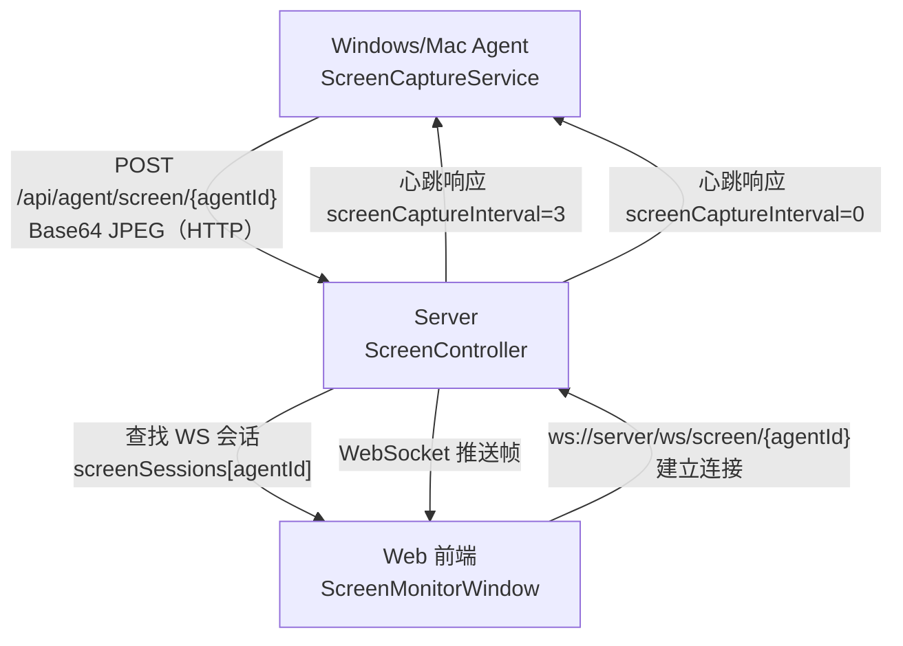
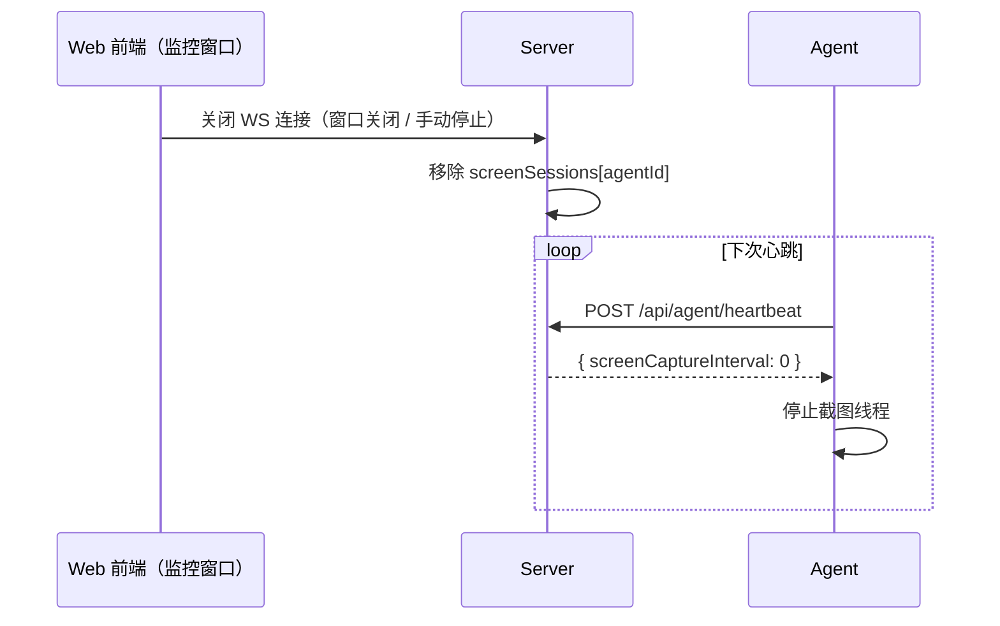

# 设计文档：屏幕监控（Screen Monitoring）

## 概述

屏幕监控功能允许管理员通过 Web 界面实时查看 Agent 所在机器的屏幕画面。采用**截图 + WebSocket 推送**方案：

- Agent 端：定时截图（`java.awt.Robot`）→ JPEG 压缩 → HTTP POST 推送到服务器（复用现有 HTTP 架构，Agent 无需 WebSocket）
- 服务器端：收到截图后，通过 WebSocket 主动推送给正在监控的前端
- 前端：监控窗口建立 WebSocket 连接，被动接收帧，延迟约 1-2 秒

该功能对 **Windows 和 macOS** Agent 开放（依赖 `java.awt.Robot`），Linux Agent 不支持（无桌面环境）。监控开关由前端 WS 连接状态驱动：WS 建立时服务器开始接受截图并转发，WS 断开时服务器停止，Agent 在下次心跳时收到 `screenCaptureInterval=0` 停止截图线程。

> macOS 注意：`java.awt.Robot` 截图需要系统授予"屏幕录制"权限（System Preferences → Security & Privacy → Screen Recording）。未授权时截图会返回黑屏，Agent 应捕获异常并在日志中提示。

## 架构



## 时序图

### 开启监控流程

```mermaid
sequenceDiagram
    participant W as Web 前端（监控窗口）
    participant S as Server
    participant A as Agent

    W->>S: WS 握手 ws://server/ws/screen/{agentId}?token=...
    S->>S: 认证 token，注册 screenSessions[agentId] = wsSession
    S-->>W: WS 连接建立

    loop 每次心跳（Agent 侧）
        A->>S: POST /api/agent/heartbeat
        S-->>A: { screenCaptureInterval: 3 }
        A->>A: 启动截图线程
    end

    loop 每3秒截图推送
        A->>A: Robot.createScreenCapture()
        A->>A: JPEG压缩(60%) + Base64编码
        A->>S: POST /api/agent/screen/{agentId}
        S->>S: 查找 screenSessions[agentId]
        S-->>W: WS 推送 { imageData: "data:image/jpeg;base64,...", timestamp: ... }
        W->>W: 更新  标签
    end
```

### 关闭监控流程



---

## 低层设计

### 依赖变更

`server/pom.xml` 新增：

```xml
<dependency>
    <groupId>org.springframework.boot</groupId>
    <artifactId>spring-boot-starter-websocket</artifactId>
</dependency>
```

---

### Agent 端

#### ScreenCaptureService.java（新增）

```java
class ScreenCaptureService {
    private final AgentApi api;
    private final String agentId;
    private final String agentToken;

    private volatile boolean running = false;
    private volatile int intervalSeconds = 0;
    private Thread captureThread;

    /** 由 AgentMain 心跳循环调用，根据服务器下发的 interval 启停截图线程 */
    synchronized void updateInterval(int newInterval) {
        if (newInterval > 0 && !running) {
            start(newInterval);
        } else if (newInterval == 0 && running) {
            stop();
        } else {
            intervalSeconds = newInterval;
        }
    }

    /** 截图 → JPEG 压缩 → Base64 → POST */
    private void captureAndUpload() {
        // 1. GraphicsEnvironment 获取主屏 bounds
        // 2. new Robot().createScreenCapture(bounds)
        // 3. ImageIO.write(image, "JPEG", baos) with JPEGImageWriteParam quality=0.6f
        // 4. Base64.getEncoder().encodeToString(baos.toByteArray())
        // 5. api.uploadScreen(agentId, agentToken, base64Data)
        // 异常处理：AWTException / SecurityException 记录日志，不抛出
    }
}
```

#### AgentApi.java（新增方法）

```java
void uploadScreen(String agentId, String agentToken, String base64ImageData) throws Exception {
    Map<String, Object> payload = new HashMap<>();
    payload.put("agentId", agentId);
    payload.put("agentToken", agentToken);
    payload.put("imageData", base64ImageData);
    payload.put("timestamp", Instant.now().toString());

    HttpPost post = new HttpPost(baseUrl + "/api/agent/screen/" + agentId);
    post.setHeader("Content-Type", "application/json");
    post.setEntity(new StringEntity(mapper.writeValueAsString(payload), "UTF-8"));

    try (CloseableHttpResponse response = httpClient.execute(post)) {
        // 忽略响应，截图上传失败不影响主流程
    }
}
```

#### AgentMain.java（修改心跳处理）

```java
// 心跳响应处理中新增：
Object screenInterval = heartbeatResponse.get("screenCaptureInterval");
if (screenInterval != null && screenCaptureService != null) {
    screenCaptureService.updateInterval(((Number) screenInterval).intValue());
}
```

`screenCaptureService` 仅在 `osType=Windows` 或 `osType=Mac` 时初始化，Linux 跳过。macOS 下初始化时额外捕获 `AWTException`，若抛出则记录权限提示日志并将 service 置为 null。

---

### Server 端

#### WebSocketConfig.java（新增）

```java
@Configuration
@EnableWebSocket
public class WebSocketConfig implements WebSocketConfigurer {

    private final ScreenSessionHandler screenSessionHandler;

    @Override
    public void registerWebSocketHandlers(WebSocketHandlerRegistry registry) {
        registry.addHandler(screenSessionHandler, "/ws/screen/{agentId}")
                .setAllowedOrigins("*"); // 生产环境限制为前端域名
    }
}
```

#### ScreenSessionHandler.java（新增，核心）

每个 WS 会话建立时记录开始时间，并调度一个超时任务（默认 30 分钟，可配置）。超时后服务器主动关闭 WS，Agent 在下次心跳时收到 `screenCaptureInterval=0` 停止截图。

```java
@Component
@Slf4j
public class ScreenSessionHandler extends TextWebSocketHandler {

    // agentId → 会话元数据
    private final ConcurrentHashMap<String, ScreenSession> sessions = new ConcurrentHashMap<>();
    private final ScheduledExecutorService scheduler = Executors.newScheduledThreadPool(1);

    @Value("${lightscript.screen.max-duration-minutes:30}")
    private int maxDurationMinutes;

    @Override
    public void afterConnectionEstablished(WebSocketSession session) {
        String agentId = extractAgentId(session);
        // 验证 JWT token（从 query param 取）
        // ...

        // 踢掉旧连接
        ScreenSession old = sessions.put(agentId, new ScreenSession(session, Instant.now()));
        if (old != null && old.wsSession().isOpen()) {
            try { old.wsSession().close(CloseStatus.POLICY_VIOLATION); } catch (Exception ignored) {}
        }

        // 调度超时强制断开
        ScheduledFuture<?> timeout = scheduler.schedule(() -> {
            log.info("[Screen] Session timeout for agent: {}, closing after {}min", agentId, maxDurationMinutes);
            forceClose(agentId, CloseStatus.SESSION_NOT_RELIABLE);
        }, maxDurationMinutes, TimeUnit.MINUTES);

        sessions.put(agentId, new ScreenSession(session, Instant.now(), timeout));
        log.info("[Screen] WS connected for agent: {}, timeout={}min", agentId, maxDurationMinutes);
    }

    @Override
    public void afterConnectionClosed(WebSocketSession session, CloseStatus status) {
        String agentId = extractAgentId(session);
        ScreenSession s = sessions.remove(agentId);
        if (s != null && s.timeoutFuture() != null) {
            s.timeoutFuture().cancel(false); // 取消超时任务，释放资源
        }
        log.info("[Screen] WS disconnected for agent: {}, status: {}", agentId, status);
    }

    /** 由 ScreenController 调用，将帧推送给前端 */
    public boolean pushFrame(String agentId, String imageData, String timestamp) {
        ScreenSession s = sessions.get(agentId);
        if (s == null || !s.wsSession().isOpen()) return false;
        try {
            String msg = String.format(
                "{\"imageData\":\"data:image/jpeg;base64,%s\",\"timestamp\":\"%s\"}",
                imageData, timestamp);
            s.wsSession().sendMessage(new TextMessage(msg));
            return true;
        } catch (Exception e) {
            log.warn("[Screen] Failed to push frame to {}: {}", agentId, e.getMessage());
            sessions.remove(agentId);
            return false;
        }
    }

    public boolean isMonitoring(String agentId) {
        ScreenSession s = sessions.get(agentId);
        return s != null && s.wsSession().isOpen();
    }

    private void forceClose(String agentId, CloseStatus status) {
        ScreenSession s = sessions.remove(agentId);
        if (s != null && s.wsSession().isOpen()) {
            try { s.wsSession().close(status); } catch (Exception ignored) {}
        }
    }

    private String extractAgentId(WebSocketSession session) {
        String path = session.getUri().getPath();
        return path.substring(path.lastIndexOf('/') + 1);
    }
}

/** 会话元数据（纯内存，不持久化） */
record ScreenSession(WebSocketSession wsSession, Instant startTime, ScheduledFuture<?> timeoutFuture) {
    ScreenSession(WebSocketSession ws, Instant start) { this(ws, start, null); }
}
```

#### ScreenController.java（新增）

```java
@RestController
@RequiredArgsConstructor
@Slf4j
public class ScreenController {

    private final ScreenSessionHandler screenSessionHandler;

    /** Agent 推送截图 → 转发给 WS 前端 */
    @PostMapping("/api/agent/screen/{agentId}")
    public ResponseEntity<?> receiveFrame(
            @PathVariable String agentId,
            @RequestBody Map<String, Object> payload) {

        if (!screenSessionHandler.isMonitoring(agentId)) {
            // 没有前端在看，告知 Agent 停止（Agent 会在下次心跳时收到 interval=0）
            return ResponseEntity.ok(Map.of("skip", true));
        }

        String imageData = (String) payload.get("imageData");
        String timestamp = (String) payload.get("timestamp");
        screenSessionHandler.pushFrame(agentId, imageData, timestamp);

        return ResponseEntity.ok(Map.of("pushed", true));
    }
}
```

#### AgentController.java（修改心跳响应）

```java
// 注入 ScreenSessionHandler
private final ScreenSessionHandler screenSessionHandler;

// 心跳响应中追加：
int screenInterval = screenSessionHandler.isMonitoring(agentId) ? 3 : 0;
response.put("screenCaptureInterval", screenInterval);
```

#### Security 配置（修改）

WebSocket 握手端点需要放行（握手本身通过 query param 携带 JWT 验证）：

```java
.antMatchers("/ws/screen/**").permitAll() // WS 握手由 Handler 内部验证 token
```

---

### 前端

#### Agents.jsx（修改）

当 `agent.osType` 为 `Windows` 或 `Mac` 时显示"屏幕监控"按钮：

```jsx
{['Windows', 'Mac'].includes(agent.osType) && (
  <Button onClick={() => openScreenMonitor(agent.agentId)}>
    屏幕监控
  </Button>
)}
```

#### ScreenMonitorWindow.jsx（新增组件）

在新窗口（或全屏 Modal）中建立 WebSocket 连接，被动接收帧：

```jsx
function ScreenMonitorWindow({ agentId, onClose }) {
  const [imageData, setImageData] = useState(null);
  const [status, setStatus] = useState('connecting'); // connecting | live | error
  const [lastUpdate, setLastUpdate] = useState(null);
  const wsRef = useRef(null);

  useEffect(() => {
    const token = getAuthToken(); // 从 localStorage/context 取 JWT
    const ws = new WebSocket(`ws://${location.host}/ws/screen/${agentId}?token=${token}`);
    wsRef.current = ws;

    ws.onopen = () => setStatus('live');
    ws.onclose = () => setStatus('error');
    ws.onerror = () => setStatus('error');

    ws.onmessage = (event) => {
      const data = JSON.parse(event.data);
      setImageData(data.imageData);
      setLastUpdate(data.timestamp);
    };

    return () => ws.close();
  }, [agentId]);

  return (
    <Modal title={`屏幕监控 - ${agentId}`} onClose={onClose} width={1280}>
      <div style={{ position: 'relative' }}>
        {status === 'connecting' && <div>正在连接...</div>}
        {status === 'error' && <div>连接失败，请重试</div>}
        {imageData && (
          
        )}
        {!imageData && status === 'live' && <div>等待截图...</div>}
      </div>
      {lastUpdate && (
        <div style={{ fontSize: 12, color: '#999', marginTop: 4 }}>
          更新时间: {new Date(lastUpdate).toLocaleTimeString()}
        </div>
      )}
    </Modal>
  );
}
```

---

## 数据模型

### 内存状态（纯内存，不持久化，不写磁盘）

| 结构 | Key | Value | 说明 |
|------|-----|-------|------|
| `ScreenSessionHandler.sessions` | agentId | `ScreenSession{wsSession, startTime, timeoutFuture}` | 当前监控该 agent 的 WS 会话，同一 agentId 只保留最新一个 |

截图帧数据在服务器内存中**不缓存**，收到后立即通过 WS 转发，转发完即丢弃。

### 心跳响应新增字段

```json
{ "screenCaptureInterval": 3 }
```

- `0`：停止截图（无前端连接）
- `3`：每 3 秒截图一次

### 截图上传请求体（Agent → Server，HTTP POST）

```json
{
  "agentId": "agent-xxx",
  "agentToken": "...",
  "imageData": "<base64 JPEG>",
  "timestamp": "2026-03-18T10:00:00Z"
}
```

### WS 推送消息体（Server → 前端）

```json
{
  "imageData": "data:image/jpeg;base64,<...>",
  "timestamp": "2026-03-18T10:00:00Z"
}
```

---

## 关键参数

| 参数 | 值 | 说明 |
|------|-----|------|
| JPEG 质量 | 0.6f | 1080p 约 100-200KB/帧 |
| 截图间隔 | 3 秒 | 带宽约 50-80KB/s |
| 最大延迟 | ~1-2 秒 | 截图 + 上传 + WS 推送 |
| 单次监控上限 | 30 分钟（可配置） | 超时后服务器主动断开 WS，Agent 停止截图 |
| WS 连接数 | 每 agentId 最多 1 个 | 同一 agent 多窗口时踢掉旧连接 |
| 服务器内存 | 极小 | 只存 WS session 引用，帧数据收到即转发即丢弃 |
| 磁盘写入 | 无 | 截图数据全程内存，不落盘 |

配置项（`application.yml`）：

```yaml
lightscript:
  screen:
    max-duration-minutes: 30  # 单次监控最长时间，超时服务器主动断开
```

---

## 约束与边界

- `osType = Windows` 和 `osType = Mac` 的 Agent 启用截图功能，Linux Agent 忽略 `screenCaptureInterval` 字段
- `java.awt.Robot` 需要有效的桌面会话：
  - Windows：Service 账户无桌面时会抛异常，需捕获并记录日志，不影响主流程
  - macOS：需要"屏幕录制"权限（System Preferences → Security & Privacy → Screen Recording），未授权时截图返回黑屏，Agent 应检测并上报 `screenError` 字段提示用户
- 多显示器场景默认截主屏（`GraphicsEnvironment.getLocalGraphicsEnvironment().getDefaultScreenDevice()`）
- 服务器重启后所有 WS 连接断开，前端需重新打开监控窗口
- Agent 端不引入 WebSocket，仍使用 HTTP POST 推帧，架构改动最小
- WS 握手认证：前端通过 query param `?token=<JWT>` 传递，Handler 内部验证，避免 Spring Security 拦截 WS 升级请求
- **纯内存原则**：截图数据全程不写磁盘，服务器收到帧后立即转发给 WS 前端，转发完即丢弃；WS 断开后所有相关内存立即释放
- **超时保护**：单次监控会话最长 N 分钟（默认 30，可通过 `lightscript.screen.max-duration-minutes` 配置）；超时后服务器主动关闭 WS 连接，同时取消超时调度任务释放线程资源；Agent 在下次心跳时收到 `screenCaptureInterval=0` 停止截图线程
- **前端关闭即停止**：WS 断开（窗口关闭、刷新、网络中断）时 `afterConnectionClosed` 立即触发，`sessions` 中的记录被移除，Agent 在下次心跳（最多 3 秒后）收到停止指令
