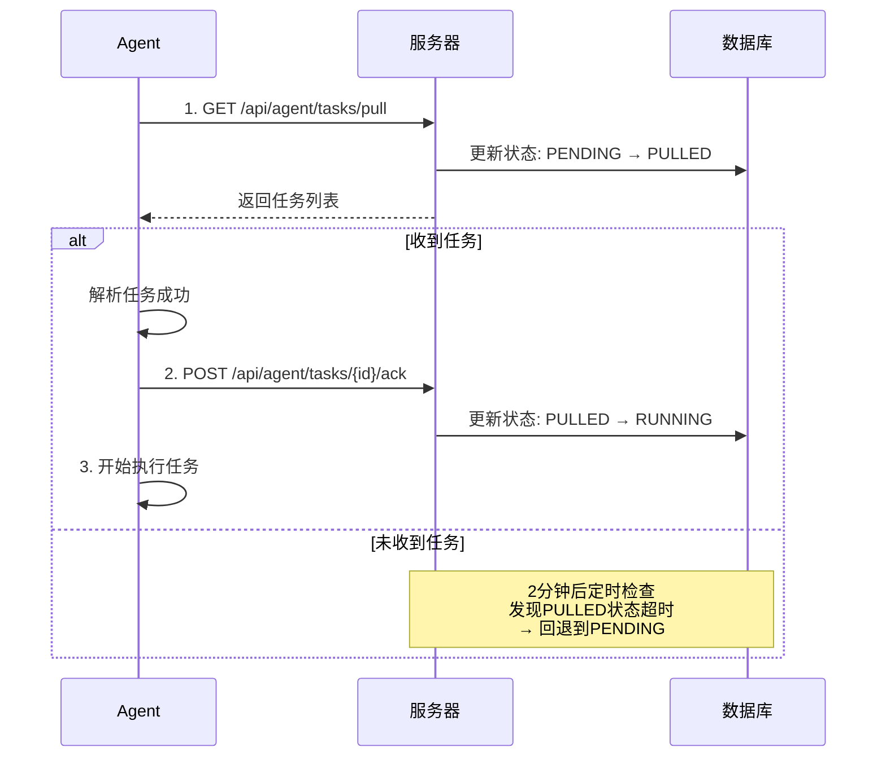
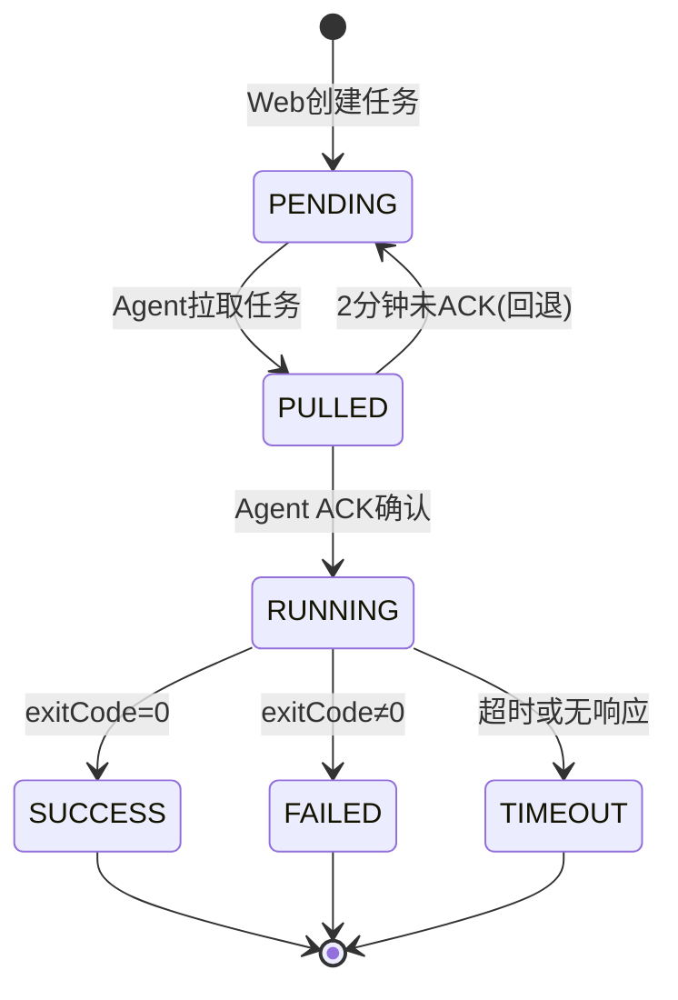

# 任务ACK机制设计文档

## 🎯 问题背景

### 原有问题

在之前的实现中，任务一旦被Agent拉取，服务器立即将状态从`PENDING`改为`RUNNING`：

```
Agent pull → 服务器标记RUNNING → 返回任务 → ❌ 网络断开
                                          ↓
                                  任务永久卡在RUNNING状态
```

**问题**：
- ❌ Agent没收到任务，但服务器以为已下发
- ❌ 任务状态无法回退，只能等待30分钟超时
- ❌ 服务器无法感知下发失败

---

## ✅ 解决方案：ACK确认机制

### 核心思路

引入中间状态`PULLED`和ACK确认机制：



---

## 📊 任务状态流转

### 新增状态：PULLED



### 状态说明

| 状态 | 含义 | 持续时间 | 下一步 |
|-----|------|---------|--------|
| **PENDING** | 任务已创建，等待Agent拉取 | 无限期 | → PULLED |
| **PULLED** | 任务已被Agent拉取，等待ACK | 最多2分钟 | → RUNNING 或 → PENDING |
| **RUNNING** | 任务已确认收到，正在执行 | 最多30分钟 | → SUCCESS/FAILED/TIMEOUT |
| **SUCCESS** | 任务执行成功 | 终态 | - |
| **FAILED** | 任务执行失败 | 终态 | - |
| **TIMEOUT** | 任务超时 | 终态 | - |

---

## 🔧 技术实现

### 服务器端修改

#### 1. **Task实体** - 新增pulledAt字段

```java
@Column(name = "pulled_at")
private LocalDateTime pulledAt;

@Column(name = "status", length = 20)
private String status = "PENDING"; // PENDING | PULLED | RUNNING | ...
```

#### 2. **TaskRepository** - 新增查询方法

```java
@Query("SELECT t FROM Task t WHERE t.status = 'PULLED' AND t.pulledAt < :threshold")
List<Task> findPulledButNotAcked(@Param("threshold") LocalDateTime threshold);
```

#### 3. **TaskService** - 修改pullTasks

```java
@Transactional
public List<TaskSpec> pullTasks(String agentId, int maxTasks) {
    return tasks.stream()
        .peek(task -> {
            task.setStatus("PULLED");  // 改为PULLED
            task.setPulledAt(LocalDateTime.now());
            taskRepository.save(task);
        })
        .map(this::convertToTaskSpec)
        .collect(Collectors.toList());
}
```

#### 4. **TaskService** - 新增ackTask方法

```java
@Transactional
public void ackTask(String taskId) {
    Optional<Task> taskOpt = taskRepository.findById(taskId);
    if (taskOpt.isPresent()) {
        Task task = taskOpt.get();
        if ("PULLED".equals(task.getStatus())) {
            task.setStatus("RUNNING");
            task.setStartedAt(LocalDateTime.now());
            taskRepository.save(task);
            log.info("Task {} acknowledged and started", taskId);
        }
    }
}
```

#### 5. **TaskService** - 新增定时检查

```java
@Scheduled(fixedRate = 60000) // 每1分钟检查一次
@Transactional
public void checkPulledTasks() {
    LocalDateTime threshold = LocalDateTime.now().minusMinutes(2); // 2分钟没ACK
    List<Task> stuckTasks = taskRepository.findPulledButNotAcked(threshold);
    
    for (Task task : stuckTasks) {
        task.setStatus("PENDING");
        task.setPulledAt(null);
        taskRepository.save(task);
        log.warn("Task {} reset to PENDING (ACK timeout)", task.getTaskId());
    }
}
```

#### 6. **AgentController** - 新增ACK接口

```java
@PostMapping("/tasks/{taskId}/ack")
public ResponseEntity<Void> ack(@PathVariable String taskId, 
                                @RequestParam String agentId, 
                                @RequestParam String agentToken) {
    if (!agentService.validateAgent(agentId, agentToken)) {
        throw new BusinessException(ErrorCode.AGENT_TOKEN_INVALID);
    }
    taskService.ackTask(taskId);
    return ResponseEntity.ok().build();
}
```

---

### Agent端修改

#### 1. **AgentApi** - 新增ack方法

```java
void ack(String agentId, String agentToken, String taskId) throws Exception {
    String url = String.format("%s/api/agent/tasks/%s/ack?agentId=%s&agentToken=%s", 
            baseUrl, taskId, agentId, agentToken);
    HttpRequest req = HttpRequest.newBuilder()
            .uri(URI.create(url))
            .timeout(Duration.ofSeconds(5))
            .POST(HttpRequest.BodyPublishers.noBody())
            .build();
    HttpResponse<String> resp = httpClient.send(req, HttpResponse.BodyHandlers.ofString());
    if (resp.statusCode() != 200) {
        throw new RuntimeException("ACK failed: HTTP " + resp.statusCode());
    }
}
```

#### 2. **AgentMain** - pull后立即ACK

```java
// 拉取任务
List<Map<String, Object>> tasks = api.pull(...);

for (Map<String, Object> task : tasks) {
    String taskId = task.get("taskId");
    
    // 立即ACK确认收到任务
    try {
        api.ack(agentId, agentToken, taskId);
        System.out.println("Task " + taskId + " acknowledged");
    } catch (Exception e) {
        System.err.println("Failed to ACK task " + taskId);
        continue; // ACK失败，跳过执行
    }
    
    // 异步执行任务
    taskExecutor.submit(() -> {
        taskRunner.runTask(taskId, ...);
    });
}
```

---

## 🧪 测试场景

### 场景1：正常流程

```bash
1. Web创建任务 → 状态: PENDING
2. Agent拉取任务 → 状态: PULLED
3. Agent立即ACK → 状态: RUNNING
4. Agent执行完成 → 状态: SUCCESS
```

**服务器日志**：
```
Task abc123 pulled by agent xxx
Task abc123 acknowledged and started
Task abc123 finished with status SUCCESS
```

---

### 场景2：网络断开（ACK机制生效）

```bash
1. Web创建任务 → 状态: PENDING
2. Agent拉取任务 → 状态: PULLED
3. ❌ 网络断开，Agent未收到
4. 2分钟后定时检查 → 状态: PENDING (回退)
5. Agent重新拉取 → 状态: PULLED
6. Agent ACK → 状态: RUNNING
7. Agent执行完成 → 状态: SUCCESS
```

**服务器日志**：
```
Task abc123 pulled by agent xxx
Task abc123 reset to PENDING (ACK timeout, agent may not have received it)
Task abc123 pulled by agent xxx
Task abc123 acknowledged and started
Task abc123 finished with status SUCCESS
```

---

### 场景3：Agent崩溃（ACK失败）

```bash
1. Web创建任务 → 状态: PENDING
2. Agent拉取任务 → 状态: PULLED
3. Agent收到任务，准备ACK
4. ❌ Agent进程崩溃
5. 2分钟后定时检查 → 状态: PENDING (回退)
6. Agent重启后拉取 → 状态: PULLED
7. Agent ACK → 状态: RUNNING
8. Agent执行完成 → 状态: SUCCESS
```

---

## 📈 效果对比

| 特性 | 修改前 | 修改后 |
|-----|-------|--------|
| **下发失败感知** | ❌ 无法感知 | ✅ 2分钟内感知 |
| **任务状态回退** | ❌ 不支持 | ✅ 自动回退到PENDING |
| **重试机制** | ❌ 无，只能等30分钟超时 | ✅ 2分钟后自动重试 |
| **可靠性** | ⚠️ 中 | ✅ 高 |
| **Agent复杂度** | 简单 | +1个ACK调用（轻量） |

---

## ⚙️ 配置参数

### 服务器端

```java
// TaskService.java

// PULLED状态超时时间（ACK超时）
@Scheduled(fixedRate = 60000) // 检查频率：1分钟
LocalDateTime threshold = now().minusMinutes(2); // 超时阈值：2分钟

// RUNNING状态超时时间（执行超时）
@Scheduled(fixedRate = 300000) // 检查频率：5分钟
LocalDateTime threshold = now().minusMinutes(30); // 超时阈值：30分钟
```

**建议配置**：
- ACK超时：2分钟（可降低到1分钟）
- 执行超时：30分钟（根据任务类型调整）

---

## 🔍 监控指标

### 关键日志

**正常ACK**：
```
[INFO] Task {taskId} pulled by agent {agentId}
[INFO] Task {taskId} acknowledged and started
```

**ACK超时回退**：
```
[WARN] Task {taskId} reset to PENDING (ACK timeout, agent may not have received it)
```

**ACK被忽略**（状态已变化）：
```
[WARN] Task {taskId} ACK ignored, current status: {status}
```

---

## 🎓 设计原则

### 1. **幂等性**
- ACK请求可以重复发送，服务器只在`PULLED`状态时处理
- 其他状态下的ACK会被忽略（不报错）

### 2. **最终一致性**
- 即使ACK丢失，2分钟后任务会回退到PENDING
- Agent下次拉取时会重新获得该任务

### 3. **轻量级**
- Agent端只增加一个HTTP POST调用
- 无需持久化、无需复杂状态管理

### 4. **向后兼容**
- 新增`PULLED`状态，不影响现有状态
- 定时任务独立运行，不影响主流程

---

## 📝 总结

### 修改清单

**服务器端**（6个修改）：
1. `Task.java` - 新增`pulledAt`字段
2. `TaskRepository.java` - 新增查询方法
3. `TaskService.pullTasks()` - 标记为PULLED
4. `TaskService.ackTask()` - 新增ACK处理
5. `TaskService.checkPulledTasks()` - 新增定时检查
6. `AgentController.ack()` - 新增ACK接口

**Agent端**（2个修改）：
1. `AgentApi.ack()` - 新增ACK方法
2. `AgentMain` - pull后立即调用ack

### 核心优势

- ✅ **可靠性提升** - 2分钟内感知下发失败并自动重试
- ✅ **状态可控** - 任务不会永久卡在PULLED状态
- ✅ **轻量级实现** - Agent端只增加1个HTTP调用
- ✅ **易于监控** - 清晰的日志输出

### 适用场景

- ✅ **不稳定网络环境** - 网络抖动、断网重连
- ✅ **Agent频繁重启** - 开发测试、版本升级
- ✅ **高可靠性要求** - 生产环境、关键任务

---

**任务下发可靠性大幅提升！** 🎉
