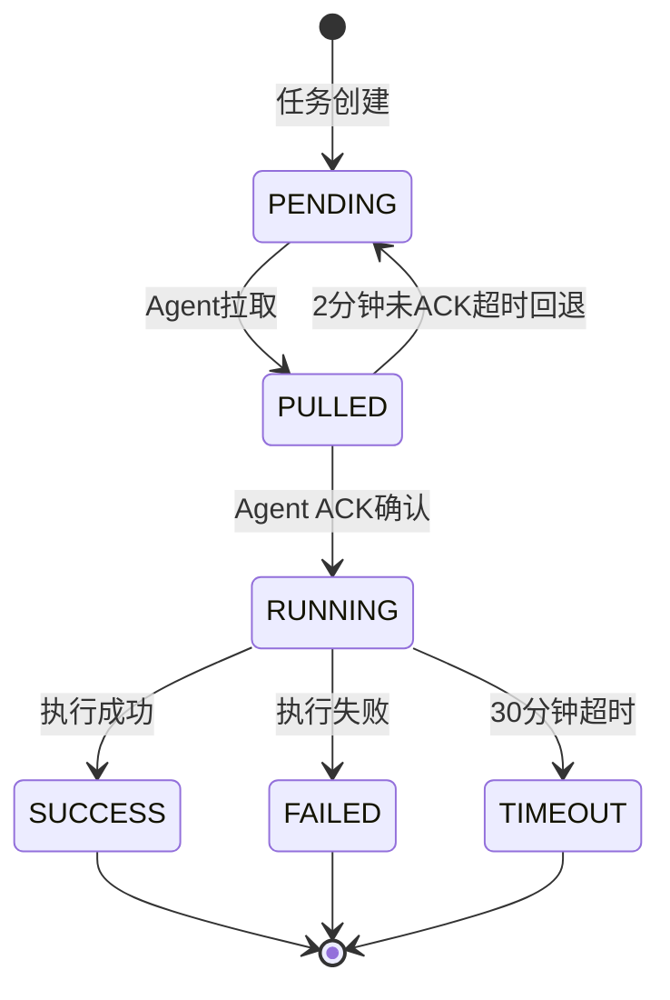

# LightScript 服务端任务管理机制说明

## 📋 概述

本文档说明服务端如何管理任务状态，以及为什么**不**自动重置失败或超时的任务。

## 🎯 核心设计原则

**关键决策**：任务失败或超时后，**不**自动重置为PENDING状态，而是保持TIMEOUT/FAILED状态，由人工决定是否重新执行。

**原因**：
1. **避免重复执行**：Agent离线不代表任务失败，可能只是网络中断，任务还在执行
2. **业务需求**：有些任务不应该被重复执行（如数据删除、支付等）
3. **人工决策**：是否重新执行应该由用户/管理员根据具体情况判断

## 🎯 服务端任务管理机制

### 1. Agent重新注册时的处理

**文件**: `server/src/main/java/com/example/lightscript/server/service/AgentService.java`

```java
@Transactional
public RegisterResponse register(RegisterRequest request) {
    if (existingAgent.isPresent()) {
        agent = existingAgent.get();
        
        // 生成新token，确保服务器重启后能重新建立连接
        agent.setAgentToken(UUID.randomUUID().toString());
        agent.setStatus("ONLINE");
        agent = agentRepository.save(agent);
        
        // ⚠️ 不重置任务！
        // Agent重连不代表任务失败，任务可能还在执行中
    }
    
    return response;
}
```

**关键点**:
- ✅ **生成新token**: 确保认证凭证有效
- ⚠️ **不重置任务**: Agent重连时不做任何任务处理

---

### 2. 任务超时机制

**文件**: `server/src/main/java/com/example/lightscript/server/service/TaskService.java`

#### 为什么不自动重置失败的任务？

**问题场景1 - 网络短暂中断**:
```
T0: Agent正常运行，任务A正在执行（如删除数据库）
T1: 网络中断1分钟
T2: Agent心跳失败，但任务A仍在执行
T3: 网络恢复，agent重连
T4: ❌ 如果自动重置任务A → 任务被执行两次！
结果：数据被错误删除多次
```

**问题场景2 - 业务逻辑要求**:
```
某些任务不应该被自动重新执行：
- 支付任务
- 数据删除任务
- 一次性配置任务
- 发送通知任务
```

**正确做法**:
- ✅ 任务超时后标记为**TIMEOUT状态**
- ✅ 由**人工判断**是否需要重新执行
- ✅ 在Web界面手动触发重新执行

---

### 3. PULLED任务超时回退

```java
@Scheduled(fixedRate = 60000) // 每1分钟检查一次
@Transactional
public void checkPulledTasks() {
    LocalDateTime threshold = LocalDateTime.now().minusMinutes(2);
    List<Task> stuckTasks = taskRepository.findPulledButNotAcked(threshold);
    
    for (Task task : stuckTasks) {
        // 2分钟未ACK的任务回退到PENDING
        task.setStatus("PENDING");
        task.setPulledAt(null);
        taskRepository.save(task);
    }
}
```

**作用**: 防止agent拉取任务后立即崩溃，导致任务永久卡在PULLED状态

---

### 4. RUNNING任务超时处理

```java
@Scheduled(fixedRate = 300000) // 每5分钟检查一次
@Transactional
public void checkTimeoutTasks() {
    LocalDateTime threshold = LocalDateTime.now().minusMinutes(30);
    List<Task> timeoutTasks = taskRepository.findTimeoutTasks(threshold);
    
    for (Task task : timeoutTasks) {
        task.setStatus("TIMEOUT");
        task.setFinishedAt(LocalDateTime.now());
        task.setSummary("Task timeout after 30 minutes");
        taskRepository.save(task);
    }
}
```

**作用**: 
- ✅ 标记长时间未完成的任务为**TIMEOUT状态**
- ✅ **不自动重置**任务，保持TIMEOUT状态
- ✅ 由人工在Web界面查看并决定是否重新执行

---

### 5. 心跳超时检测

```java
@Scheduled(fixedRate = 60000) // 每分钟检查一次
@Transactional
public void checkOfflineAgents() {
    LocalDateTime threshold = LocalDateTime.now().minusMinutes(2);
    List<Agent> offlineAgents = agentRepository.findOfflineAgents(threshold);
    
    for (Agent agent : offlineAgents) {
        if ("ONLINE".equals(agent.getStatus())) {
            // 2分钟没有心跳，标记为离线
            agent.setStatus("OFFLINE");
            agentRepository.save(agent);
        }
    }
}
```

**作用**: 检测并标记离线的agent，便于在Web界面查看agent状态

---

## 🔄 典型场景流程

### 场景1: Agent短暂网络中断

```
时间线：
T0: Agent正常运行，任务A正在执行
T1: 网络中断1分钟
T2: Agent心跳失败，但任务A继续执行
T3: 网络恢复，agent重连成功，获得新token
T4: Agent完成任务A，上报结果 ✅
T5: 任务A标记为SUCCESS

结果：任务正常完成，没有被重复执行
```

### 场景2: Agent进程崩溃

```
时间线：
T0: Agent正常运行，任务A正在执行
T1: Agent进程崩溃（kill -9）
T2: 服务端心跳超时（2分钟后），标记agent为OFFLINE
T3: 30分钟后，任务A被标记为TIMEOUT（超时机制）
T4: 用户在Web界面查看，发现任务A超时
T5: 用户判断：需要重新执行
T6: 用户手动创建新任务（或重新下发）
T7: 重启agent，拉取新任务并执行 ✅

结果：任务由人工判断是否重新执行，避免自动重复
```

### 场景3: 服务器重启

```
时间线：
T0: Agent正常运行，服务器正常
T1: 服务器重启（agent的token失效）
T2: Agent心跳失败3次，触发重新注册
T3: 服务器启动完成，agent重新注册成功
T4: Agent获得新token，恢复心跳
T5: Agent继续执行任务或上报结果 ✅

结果：Agent自动重连，任务继续执行
```

## 📊 任务状态转换图



**说明**：
- 任务超时后保持TIMEOUT状态，**不**自动重置为PENDING
- 是否重新执行由人工判断

---

## 🛡️ 任务保障机制

### 保障1: PULLED任务超时回退
- ✅ Agent拉取任务后2分钟未ACK，任务自动回退到PENDING
- ✅ 避免agent拉取后立即崩溃导致任务卡住

### 保障2: RUNNING任务超时标记
- ✅ 任务执行超过30分钟，标记为TIMEOUT
- ⚠️ **不**自动重置任务
- ✅ 由人工在Web界面查看并决定是否重新执行

### 保障3: Agent状态管理
- ✅ 2分钟没有心跳，agent标记为OFFLINE
- ✅ 便于在Web界面查看agent状态
- ⚠️ **不**因为agent离线而自动重置任务

## ⚙️ 配置参数

| 参数 | 默认值 | 说明 | 配置位置 |
|------|--------|------|----------|
| 心跳超时阈值 | 2分钟 | 多久没心跳标记为离线 | `checkOfflineAgents()` |
| PULLED超时阈值 | 2分钟 | 已拉取未ACK的超时时间 | `checkPulledTasks()` |
| RUNNING超时阈值 | 30分钟 | 任务执行的最大时间 | `checkTimeoutTasks()` |

---

## 📝 任务管理原则

### 任务不会自动重复执行
- ✅ 任务状态转换使用`@Transactional`保证原子性
- ✅ Agent拉取任务时，立即将状态从PENDING改为PULLED
- ✅ 超时任务保持TIMEOUT状态，不自动重置
- ✅ 由人工判断是否需要重新执行

### 任务状态明确
- ✅ SUCCESS: 执行成功
- ✅ FAILED: 执行失败（agent上报）
- ✅ TIMEOUT: 执行超时（系统标记）
- ✅ 所有状态都有详细日志记录

### 人工决策重新执行
- ✅ 用户在Web界面查看FAILED/TIMEOUT任务
- ✅ 根据具体情况判断是否需要重新执行
- ✅ 手动创建新任务或重新下发
- ✅ 避免不应该被重复执行的任务被自动执行（如支付、删除等）

## 🎯 测试验证

### 测试1: Agent短暂网络中断
```bash
# 1. 启动agent并下发任务
# 2. 任务执行过程中，断开网络1分钟
# 3. 恢复网络
# 4. 观察agent重连成功
# 5. 验证：任务继续执行并上报结果 ✅
# 结果：任务没有被重复执行
```

### 测试2: Agent进程崩溃
```bash
# 1. 启动agent并下发任务
# 2. 任务执行过程中，kill掉agent进程
# 3. 等待30分钟
# 4. 观察任务被标记为TIMEOUT
# 5. 在Web界面查看超时任务
# 6. 根据需要手动重新创建任务
# 结果：任务由人工决定是否重新执行
```

### 测试3: 服务器重启
```bash
# 1. Agent正常运行
# 2. 重启服务器
# 3. 观察agent日志
#    - 心跳失败3次
#    - 触发重新注册
#    - 重新注册成功获得新token
# 4. Agent继续工作 ✅
```

## 📚 相关代码文件

| 文件 | 说明 |
|------|------|
| `AgentService.java` | Agent注册、心跳、状态管理 |
| `TaskService.java` | 任务管理、超时检查 |
| `AgentRepository.java` | Agent数据访问 |
| `TaskRepository.java` | Task数据访问 |

---

## 🔧 故障排查

### 问题: 任务超时了怎么办？

**查看任务状态**:
```sql
-- 查看超时任务
SELECT task_id, status, agent_id, created_at, started_at, summary
FROM tasks 
WHERE status = 'TIMEOUT'
ORDER BY created_at DESC;

-- 查看任务日志
SELECT * FROM task_logs 
WHERE task_id = 'xxx' 
ORDER BY seq_num;
```

**处理步骤**:
1. 在Web界面查看任务详情和日志
2. 分析超时原因（agent崩溃？任务执行时间过长？）
3. 判断是否需要重新执行
4. 如需重新执行，手动创建新任务

---

## 总结

通过以上服务端任务管理机制，LightScript系统能够：

✅ **自动恢复连接**: Agent重连后自动获得新token
✅ **任务不重复执行**: 不自动重置超时任务，避免重复执行风险
✅ **状态明确**: TIMEOUT/FAILED/SUCCESS状态清晰
✅ **人工决策**: 是否重新执行由用户判断
✅ **日志完整**: 记录所有状态变更
✅ **避免误操作**: 某些任务不应该被自动重复执行（如支付、删除等）

这使得LightScript成为一个安全、可控的分布式脚本执行系统。
