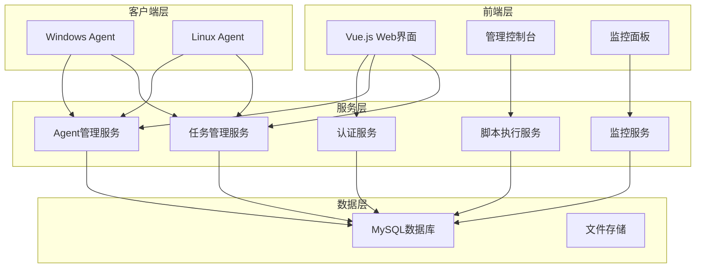

# LightScript 分布式脚本执行管理系统 - 详细设计文档

## 📋 文档概述

### 文档目的
本文档基于《需求分析文档》，提供LightScript系统的详细技术设计方案，包括系统架构、模块设计、接口定义、数据库设计和分阶段实现计划。

### 设计原则
- **模块化设计**：高内聚、低耦合的模块划分
- **可扩展性**：支持功能扩展和性能扩展
- **安全性**：全方位的安全防护机制
- **高可用性**：故障恢复和容错处理
- **性能优化**：资源使用最小化

## 🏗️ 系统架构设计

### 1.1 总体架构



### 1.2 技术架构栈

| 层级 | 技术选型 | 版本 | 说明 |
|------|----------|------|------|
| 前端 | Vue.js | 3.3.0 | 现代化Web界面 |
| UI组件 | Element Plus | 2.4.0 | 企业级UI组件库 |
| HTTP客户端 | Axios | 1.5.0 | API请求处理 |
| 后端框架 | Spring Boot | 2.7.18 | 企业级Java框架 |
| 安全框架 | Spring Security | - | 认证授权 |
| 数据访问 | Spring Data JPA | - | ORM框架 |
| 数据库 | MySQL | 8.0 | 关系型数据库 |
| 客户端 | Java | 1.8 | 跨平台Agent |
| 构建工具 | Maven | 3.6+ | 项目构建管理 |

## 🔧 核心模块设计

### 2.1 认证授权模块

#### 2.1.1 功能设计
- **用户认证**：用户名/密码登录
- **JWT令牌**：无状态令牌管理
- **权限控制**：基于角色的访问控制
- **会话管理**：令牌刷新和过期处理

#### 2.1.2 核心类设计
```java
// 用户实体
@Entity
public class User {
    private String userId;
    private String username;
    private String password; // BCrypt加密
    private String role; // ADMIN, USER
    private LocalDateTime createdAt;
    private LocalDateTime lastLoginAt;
}

// JWT工具类
public class JwtUtil {
    public String generateToken(String username, String role);
    public boolean validateToken(String token);
    public String getUsernameFromToken(String token);
}
```

### 2.2 Agent管理模块

#### 2.2.1 功能设计
- **Agent注册**：客户端自动注册
- **状态监控**：心跳检测和状态更新
- **信息管理**：系统信息收集和展示
- **分组管理**：Agent标签和分组

#### 2.2.2 数据模型
```java
@Entity
public class Agent {
    private String agentId;        // 唯一标识
    private String agentToken;     // 认证令牌
    private String hostname;       // 主机名
    private String osType;         // WINDOWS | LINUX
    private String ip;             // IP地址
    private Map<String, String> labels; // 标签
    private LocalDateTime lastHeartbeat; // 最后心跳
    private String status;         // ONLINE | OFFLINE
    private Double cpuLoad;        // CPU负载
    private Long freeMemMb;        // 可用内存
}
```

### 2.3 任务管理模块

#### 2.3.1 功能设计
- **任务创建**：单个和批量任务创建
- **任务调度**：任务分发和执行管理
- **状态跟踪**：实时状态更新
- **结果收集**：执行结果和日志收集

#### 2.3.2 数据模型
```java
@Entity
public class Task {
    private String taskId;         // 任务ID
    private String agentId;        // 目标Agent
    private String scriptLang;     // bash | powershell | cmd
    private String scriptContent;  // 脚本内容
    private Integer timeoutSec;    // 超时时间
    private Map<String, String> env; // 环境变量
    private String status;         // 任务状态
    private Integer exitCode;      // 退出码
    private String summary;        // 执行摘要
    private String createdBy;      // 创建者
    private LocalDateTime createdAt;
    private LocalDateTime startedAt;
    private LocalDateTime finishedAt;
}

@Entity
public class TaskLog {
    private String logId;
    private String taskId;
    private String logLevel;       // INFO | WARN | ERROR
    private String message;        // 日志内容
    private LocalDateTime timestamp;
}
```

### 2.4 脚本执行模块

#### 2.4.1 执行器设计
```java
public interface ScriptExecutor {
    ExecutionResult execute(String script, Map<String, String> env, int timeoutSec);
}

public class BashExecutor implements ScriptExecutor {
    // Linux Bash脚本执行
}

public class PowerShellExecutor implements ScriptExecutor {
    // Windows PowerShell脚本执行
}

public class CmdExecutor implements ScriptExecutor {
    // Windows CMD脚本执行
}
```

#### 2.4.2 安全机制
- **脚本验证**：危险命令检测
- **执行隔离**：进程隔离和资源限制
- **权限控制**：最小权限原则
- **审计日志**：完整的执行记录

## 📊 数据库设计

### 3.1 表结构设计

#### 3.1.1 用户表 (users)
```sql
CREATE TABLE users (
    user_id VARCHAR(64) PRIMARY KEY,
    username VARCHAR(50) UNIQUE NOT NULL,
    password VARCHAR(255) NOT NULL,
    role VARCHAR(20) NOT NULL DEFAULT 'USER',
    created_at TIMESTAMP DEFAULT CURRENT_TIMESTAMP,
    last_login_at TIMESTAMP,
    INDEX idx_username (username)
);
```

#### 3.1.2 Agent表 (agents)
```sql
CREATE TABLE agents (
    agent_id VARCHAR(64) PRIMARY KEY,
    agent_token VARCHAR(64) NOT NULL,
    hostname VARCHAR(255) NOT NULL,
    os_type VARCHAR(20) NOT NULL,
    ip VARCHAR(45),
    last_heartbeat TIMESTAMP,
    status VARCHAR(20) DEFAULT 'ONLINE',
    cpu_load DOUBLE,
    free_mem_mb BIGINT,
    created_at TIMESTAMP DEFAULT CURRENT_TIMESTAMP,
    updated_at TIMESTAMP DEFAULT CURRENT_TIMESTAMP ON UPDATE CURRENT_TIMESTAMP,
    INDEX idx_status (status),
    INDEX idx_last_heartbeat (last_heartbeat)
);
```

#### 3.1.3 任务表 (tasks)
```sql
CREATE TABLE tasks (
    task_id VARCHAR(64) PRIMARY KEY,
    agent_id VARCHAR(64) NOT NULL,
    script_lang VARCHAR(20),
    script_content TEXT,
    timeout_sec INT DEFAULT 300,
    status VARCHAR(20) DEFAULT 'PENDING',
    exit_code INT,
    summary TEXT,
    created_by VARCHAR(64),
    created_at TIMESTAMP DEFAULT CURRENT_TIMESTAMP,
    started_at TIMESTAMP,
    finished_at TIMESTAMP,
    INDEX idx_agent_id (agent_id),
    INDEX idx_status (status),
    INDEX idx_created_at (created_at),
    FOREIGN KEY (agent_id) REFERENCES agents(agent_id)
);
```

### 3.2 索引优化策略
- **主键索引**：所有表的主键自动创建聚簇索引
- **状态索引**：任务和Agent状态字段创建索引
- **时间索引**：创建时间和心跳时间创建索引
- **复合索引**：根据查询模式创建复合索引

## 🔌 API接口设计

### 4.1 认证接口

#### 4.1.1 用户登录
```http
POST /api/auth/login
Content-Type: application/json

{
    "username": "admin",
    "password": "admin123"
}

Response:
{
    "success": true,
    "data": {
        "token": "eyJhbGciOiJIUzI1NiJ9...",
        "username": "admin",
        "role": "ADMIN",
        "expiresIn": 86400
    }
}
```

### 4.2 Agent管理接口

#### 4.2.1 Agent注册
```http
POST /api/agent/register
Content-Type: application/json

{
    "registerToken": "dev-register-token",
    "hostname": "server-01",
    "osType": "LINUX"
}

Response:
{
    "success": true,
    "data": {
        "agentId": "agent-001",
        "agentToken": "token-001"
    }
}
```

#### 4.2.2 心跳检测
```http
POST /api/agent/heartbeat
Authorization: Bearer {agentToken}

{
    "agentId": "agent-001",
    "cpuLoad": 0.25,
    "freeMemMb": 2048
}
```

### 4.3 任务管理接口

#### 4.3.1 创建任务
```http
POST /api/tasks
Authorization: Bearer {userToken}

{
    "agentIds": ["agent-001", "agent-002"],
    "scriptLang": "bash",
    "scriptContent": "echo 'Hello World'",
    "timeoutSec": 300,
    "env": {
        "ENV_VAR": "value"
    }
}
```

#### 4.3.2 拉取任务
```http
GET /api/agent/tasks/pull?limit=5
Authorization: Bearer {agentToken}

Response:
{
    "success": true,
    "data": {
        "tasks": [
            {
                "taskId": "task-001",
                "scriptLang": "bash",
                "scriptContent": "echo 'test'",
                "timeoutSec": 300
            }
        ]
    }
}
```

## 🚀 分阶段实现计划

### 第一阶段：代码质量提升 (1-2周)

#### 阶段目标
- 修复所有编译错误
- 完善异常处理机制
- 统一日志记录标准
- 增加基础单元测试

#### 具体任务
1. **编译错误修复**
   - 检查并修复所有Java编译错误
   - 解决依赖冲突和版本问题
   - 确保Maven构建成功

2. **异常处理完善**
   - 统一异常处理机制
   - 定义业务异常类型
   - 完善错误码体系

3. **日志系统优化**
   - 统一日志格式和级别
   - 配置日志轮转策略
   - 添加关键操作日志

4. **单元测试**
   - 为核心Service类添加单元测试
   - 测试覆盖率达到60%以上
   - 集成测试环境搭建

#### 验收标准
- [ ] 项目可以正常编译和启动
- [ ] 所有API接口正常响应
- [ ] 基础功能测试通过
- [ ] 日志记录完整清晰

### 第二阶段：性能优化 (2-3周)

#### 阶段目标
- Agent资源占用优化
- 数据库查询性能优化
- 前端加载速度提升
- 并发处理能力增强

#### 具体任务
1. **Agent优化**
   - 内存使用优化，控制在50MB以内
   - CPU占用优化，空闲时<5%
   - 网络请求优化，减少不必要的轮询
   - 连接池和资源复用

2. **数据库优化**
   - 添加必要的数据库索引
   - 优化慢查询SQL
   - 配置数据库连接池
   - 实现分页查询

3. **前端优化**
   - 静态资源压缩和缓存
   - 组件懒加载
   - API请求防抖和节流
   - 页面加载性能优化

4. **并发优化**
   - 异步任务处理
   - 线程池配置优化
   - 数据库连接池调优
   - 缓存机制引入

#### 验收标准
- [ ] Agent内存占用<50MB，CPU<5%
- [ ] 支持100+并发客户端连接
- [ ] 页面加载时间<3秒
- [ ] API响应时间<1秒

### 第三阶段：功能增强 (3-4周)

#### 阶段目标
- 脚本模板管理
- 定时任务调度
- 文件传输功能
- 监控告警系统

#### 具体任务
1. **脚本模板管理**
   ```java
   @Entity
   public class ScriptTemplate {
       private String templateId;
       private String templateName;
       private String scriptLang;
       private String templateContent;
       private String description;
       private List<String> parameters;
   }
   ```

2. **定时任务调度**
   - 集成Quartz调度器
   - 支持Cron表达式
   - 任务执行历史记录
   - 调度任务管理界面

3. **文件传输功能**
   - 文件上传到Agent
   - Agent文件下载
   - 文件分发到多个Agent
   - 传输进度监控

4. **监控告警系统**
   - Agent离线告警
   - 任务执行失败告警
   - 系统资源告警
   - 邮件/短信通知

#### 验收标准
- [ ] 脚本模板CRUD功能完整
- [ ] 定时任务正常调度执行
- [ ] 文件传输功能稳定可靠
- [ ] 告警通知及时准确

### 第四阶段：企业级特性 (4-6周)

#### 阶段目标
- 集群部署支持
- 容器化部署
- 插件系统架构
- 多租户支持

#### 具体任务
1. **集群部署**
   - 服务注册与发现
   - 负载均衡配置
   - 数据一致性保证
   - 故障转移机制

2. **容器化部署**
   - Docker镜像制作
   - Docker Compose配置
   - Kubernetes部署文件
   - 容器监控和日志

3. **插件系统**
   - 插件接口定义
   - 插件加载机制
   - 插件管理界面
   - 示例插件开发

4. **多租户支持**
   - 租户隔离机制
   - 资源配额管理
   - 权限细粒度控制
   - 租户管理界面

#### 验收标准
- [ ] 支持多节点集群部署
- [ ] 容器化部署成功
- [ ] 插件系统可扩展
- [ ] 多租户功能完整

## 🔒 安全设计

### 5.1 认证安全
- **密码策略**：强密码要求，定期更换
- **令牌管理**：JWT令牌，定期刷新
- **会话安全**：会话超时，单点登录
- **多因素认证**：支持2FA认证（可选）

### 5.2 通信安全
- **HTTPS传输**：所有API使用HTTPS
- **令牌验证**：Agent令牌验证
- **请求签名**：关键请求数字签名
- **防重放攻击**：时间戳和随机数

### 5.3 执行安全
- **脚本验证**：危险命令检测和拦截
- **权限控制**：最小权限原则
- **资源限制**：CPU、内存、磁盘限制
- **审计日志**：完整的操作审计

## 📈 监控设计

### 6.1 系统监控
- **服务器监控**：CPU、内存、磁盘、网络
- **应用监控**：JVM指标、线程池状态
- **数据库监控**：连接数、查询性能
- **Agent监控**：在线状态、资源使用

### 6.2 业务监控
- **任务监控**：执行成功率、平均耗时
- **用户监控**：登录统计、操作统计
- **错误监控**：异常统计、错误分析
- **性能监控**：响应时间、吞吐量

### 6.3 告警机制
- **阈值告警**：资源使用超过阈值
- **异常告警**：系统异常和错误
- **业务告警**：任务失败、Agent离线
- **通知方式**：邮件、短信、钉钉

## 🎯 质量保证

### 7.1 代码质量
- **代码规范**：统一的编码规范
- **代码审查**：Pull Request审查机制
- **静态分析**：SonarQube代码质量检查
- **单元测试**：测试覆盖率>80%

### 7.2 性能测试
- **压力测试**：并发用户和Agent测试
- **负载测试**：长时间运行稳定性
- **性能基准**：关键指标基准测试
- **性能监控**：持续性能监控

### 7.3 安全测试
- **漏洞扫描**：自动化安全扫描
- **渗透测试**：模拟攻击测试
- **安全审计**：定期安全审计
- **合规检查**：安全合规性检查

## 📋 总结

本详细设计文档为LightScript系统提供了完整的技术实现方案，包括：

1. **清晰的架构设计**：模块化、可扩展的系统架构
2. **详细的功能设计**：核心模块的详细设计方案
3. **完整的数据设计**：数据库表结构和索引优化
4. **标准的接口设计**：RESTful API接口规范
5. **分阶段实现计划**：4个阶段的详细实施计划
6. **全面的安全设计**：多层次的安全防护机制
7. **完善的监控设计**：系统和业务监控体系
8. **严格的质量保证**：代码质量和测试标准

通过按照本设计文档的规划实施，LightScript将成为一个功能完整、性能优异、安全可靠的企业级分布式脚本执行管理平台。
