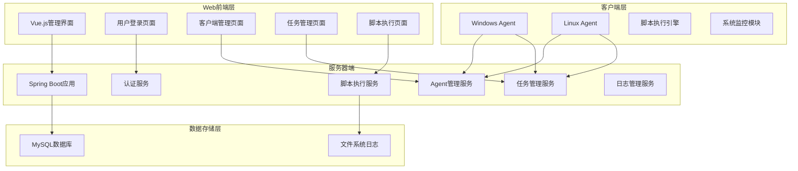
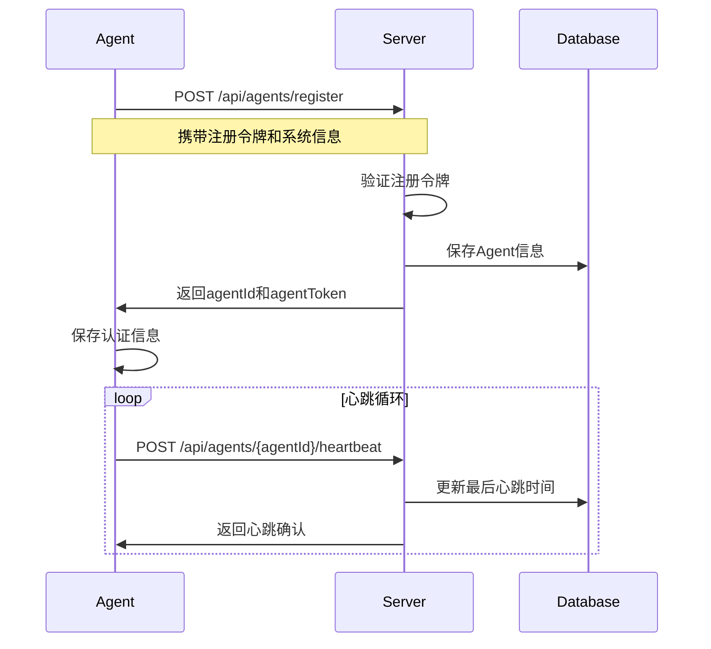
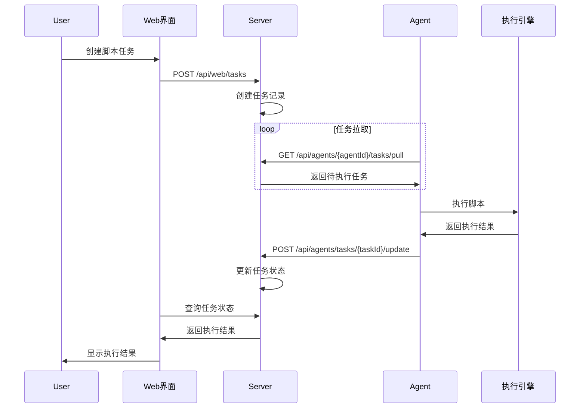
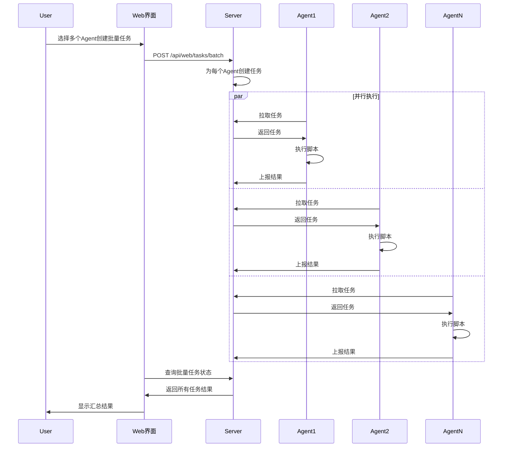
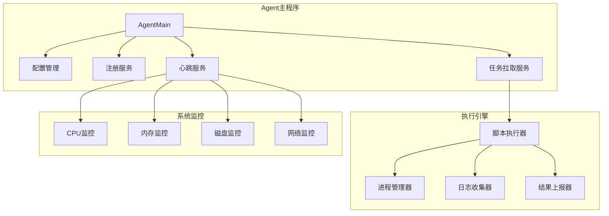

# LightScript 分布式脚本执行管理系统 - 功能设计文档

## 📋 文档概述

### 文档目的
本文档基于需求分析文档，详细描述LightScript系统的功能设计方案，包括系统架构、功能模块、接口设计、数据流程和技术实现细节。

### 设计原则
- **简洁高效**：功能设计简洁明了，避免过度复杂化
- **资源优化**：特别关注Agent端资源占用，确保轻量级运行
- **跨平台兼容**：支持Windows和Linux双平台无缝运行
- **安全可靠**：确保脚本执行安全和数据传输可靠性
- **易于维护**：代码结构清晰，便于后续维护和扩展

## 🏗️ 系统架构设计

### 1.1 总体架构



### 1.2 技术架构栈

| 层级 | 组件 | 技术选型 | 版本要求 |
|------|------|----------|----------|
| 前端 | Web界面 | Vue.js | 3.x |
| 前端 | UI组件 | Element Plus | 2.4+ |
| 前端 | HTTP客户端 | Axios | 1.5+ |
| 后端 | 应用框架 | Spring Boot | 2.7.18 |
| 后端 | 安全框架 | Spring Security | 集成版本 |
| 后端 | 数据访问 | Spring Data JPA | 集成版本 |
| 数据库 | 关系数据库 | MySQL | 8.0 |
| 客户端 | 运行环境 | Java | 1.8 |
| 客户端 | HTTP客户端 | Java HttpClient | 内置 |
| 构建 | 构建工具 | Maven | 3.6+ |

## 🎯 功能模块设计

### 2.1 用户认证模块

#### 2.1.1 功能描述
- 提供用户登录认证功能
- 基于JWT的无状态认证机制
- 支持会话管理和权限控制

#### 2.1.2 核心功能
```java
// 用户实体设计
@Entity
public class User {
    private String userId;
    private String username;
    private String password; // BCrypt加密
    private String role;     // ADMIN, USER
    private LocalDateTime createdAt;
    private LocalDateTime lastLoginAt;
}

// 认证服务接口
public interface AuthService {
    LoginResponse login(String username, String password);
    boolean validateToken(String token);
    void logout(String token);
}
```

#### 2.1.3 接口设计
- `POST /api/auth/login` - 用户登录
- `POST /api/auth/logout` - 用户登出
- `GET /api/auth/validate` - 令牌验证

### 2.2 客户端管理模块

#### 2.2.1 功能描述
- 管理所有连接的Agent客户端
- 实时监控客户端状态和系统信息
- 支持客户端搜索、筛选和批量操作

#### 2.2.2 核心功能
```java
// Agent实体设计
@Entity
public class Agent {
    private String agentId;
    private String hostname;
    private String ip;
    private String osType;        // WINDOWS, LINUX
    private String status;        // ONLINE, OFFLINE
    private Double cpuLoad;
    private Long freeMemMb;
    private LocalDateTime lastHeartbeat;
    private LocalDateTime createdAt;
}

// Agent管理服务
public interface AgentService {
    Agent registerAgent(AgentRegisterRequest request);
    void updateHeartbeat(String agentId);
    List<Agent> getOnlineAgents();
    Agent getAgentById(String agentId);
}
```

#### 2.2.3 接口设计
- `GET /api/web/agents` - 获取客户端列表
- `GET /api/web/agents/{agentId}` - 获取客户端详情
- `POST /api/agents/register` - 客户端注册
- `POST /api/agents/{agentId}/heartbeat` - 心跳上报

### 2.3 任务管理模块

#### 2.3.1 功能描述
- 创建和管理脚本执行任务
- 支持单个和批量任务下发
- 实时监控任务执行状态和进度

#### 2.3.2 核心功能
```java
// 任务实体设计
@Entity
public class Task {
    private String taskId;
    private String agentId;
    private String scriptType;    // bash, powershell, cmd
    private String scriptContent;
    private Integer timeoutSec;
    private String status;        // PENDING, RUNNING, SUCCESS, FAILED
    private Integer exitCode;
    private String summary;
    private LocalDateTime createdAt;
    private LocalDateTime startedAt;
    private LocalDateTime completedAt;
}

// 任务管理服务
public interface TaskService {
    Task createTask(TaskCreateRequest request);
    List<Task> createBatchTasks(List<String> agentIds, TaskSpec taskSpec);
    List<Task> getPendingTasks(String agentId);
    void updateTaskStatus(String taskId, TaskStatus status);
}
```

#### 2.3.3 接口设计
- `POST /api/web/tasks` - 创建单个任务
- `POST /api/web/tasks/batch` - 创建批量任务
- `GET /api/web/tasks` - 获取任务列表
- `GET /api/agents/{agentId}/tasks/pull` - Agent拉取任务
- `POST /api/agents/tasks/{taskId}/update` - 更新任务状态

### 2.4 脚本执行模块

#### 2.4.1 功能描述
- 在Agent端安全执行各种类型脚本
- 支持Windows CMD、PowerShell和Linux Bash
- 实时收集执行日志和结果

#### 2.4.2 核心功能
```java
// 脚本执行器接口
public interface ScriptExecutor {
    ExecutionResult execute(String scriptType, String scriptContent, int timeoutSec);
    void cancel(String taskId);
}

// Windows实现
public class WindowsScriptExecutor implements ScriptExecutor {
    public ExecutionResult execute(String scriptType, String scriptContent, int timeoutSec) {
        ProcessBuilder builder;
        if ("cmd".equals(scriptType)) {
            builder = new ProcessBuilder("cmd", "/c", scriptContent);
        } else if ("powershell".equals(scriptType)) {
            builder = new ProcessBuilder("powershell", "-Command", scriptContent);
        }
        // 执行逻辑...
    }
}

// Linux实现
public class LinuxScriptExecutor implements ScriptExecutor {
    public ExecutionResult execute(String scriptType, String scriptContent, int timeoutSec) {
        ProcessBuilder builder = new ProcessBuilder("bash", "-c", scriptContent);
        // 执行逻辑...
    }
}
```

### 2.5 日志管理模块

#### 2.5.1 功能描述
- 收集和管理脚本执行日志
- 提供实时日志查看功能
- 支持日志搜索和导出

#### 2.5.2 核心功能
```java
// 日志实体设计
@Entity
public class TaskLog {
    private String logId;
    private String taskId;
    private String logLevel;     // INFO, WARN, ERROR
    private String logContent;
    private LocalDateTime timestamp;
}

// 日志管理服务
public interface LogService {
    void saveLog(String taskId, String level, String content);
    List<TaskLog> getTaskLogs(String taskId);
    void clearOldLogs(int retentionDays);
}
```

## 🔄 数据流程设计

### 3.1 Agent注册流程



### 3.2 任务执行流程



### 3.3 批量任务流程



## 💻 Agent端设计

### 4.1 Agent架构设计



### 4.2 资源优化策略

#### 4.2.1 内存优化
```java
// 使用对象池减少GC压力
public class ObjectPoolManager {
    private final Queue<StringBuilder> stringBuilderPool = new ConcurrentLinkedQueue<>();
    private final Queue<ByteArrayOutputStream> streamPool = new ConcurrentLinkedQueue<>();
    
    public StringBuilder borrowStringBuilder() {
        StringBuilder sb = stringBuilderPool.poll();
        return sb != null ? sb.setLength(0) : new StringBuilder();
    }
    
    public void returnStringBuilder(StringBuilder sb) {
        if (sb.capacity() < 1024) { // 避免内存泄漏
            stringBuilderPool.offer(sb);
        }
    }
}

// 限制线程池大小
public class AgentThreadPool {
    private static final int CORE_POOL_SIZE = 2;
    private static final int MAX_POOL_SIZE = 4;
    private static final ExecutorService executor = new ThreadPoolExecutor(
        CORE_POOL_SIZE, MAX_POOL_SIZE, 60L, TimeUnit.SECONDS,
        new LinkedBlockingQueue<>(10)
    );
}
```

#### 4.2.2 CPU优化
```java
// 智能轮询间隔调整
public class AdaptivePolling {
    private int currentInterval = 5000; // 初始5秒
    private final int minInterval = 1000; // 最小1秒
    private final int maxInterval = 30000; // 最大30秒
    
    public void adjustInterval(boolean hasTasks) {
        if (hasTasks) {
            currentInterval = Math.max(minInterval, currentInterval / 2);
        } else {
            currentInterval = Math.min(maxInterval, currentInterval * 2);
        }
    }
}
```

### 4.3 跨平台兼容性

#### 4.3.1 操作系统检测
```java
public class PlatformDetector {
    public static String getOSType() {
        String osName = System.getProperty("os.name").toLowerCase();
        if (osName.contains("win")) {
            return "WINDOWS";
        } else if (osName.contains("nix") || osName.contains("nux") || osName.contains("mac")) {
            return "LINUX";
        }
        return "UNKNOWN";
    }
    
    public static ScriptExecutor createExecutor() {
        return "WINDOWS".equals(getOSType()) ? 
            new WindowsScriptExecutor() : new LinuxScriptExecutor();
    }
}
```

## 🔒 安全设计

### 5.1 认证安全
- JWT令牌有效期控制（默认24小时）
- 密码BCrypt加密存储
- 注册令牌验证机制
- 防暴力破解限制

### 5.2 脚本执行安全
```java
// 脚本内容安全检查
public class ScriptSecurityChecker {
    private static final List<String> DANGEROUS_COMMANDS = Arrays.asList(
        "rm -rf", "del /f", "format", "fdisk", "shutdown", "reboot"
    );
    
    public boolean isScriptSafe(String scriptContent) {
        String lowerScript = scriptContent.toLowerCase();
        return DANGEROUS_COMMANDS.stream()
            .noneMatch(lowerScript::contains);
    }
}

// 执行环境隔离
public class SecureExecutor {
    public ExecutionResult execute(String script) {
        ProcessBuilder pb = new ProcessBuilder();
        pb.environment().clear(); // 清除环境变量
        pb.directory(new File(System.getProperty("java.io.tmpdir"))); // 限制执行目录
        // 设置资源限制...
    }
}
```

### 5.3 网络安全
- HTTPS传输加密
- 请求签名验证
- IP白名单控制
- 防重放攻击

## 📊 性能设计

### 6.1 并发处理
```java
// 服务器端并发控制
@Configuration
public class AsyncConfig {
    @Bean
    public TaskExecutor taskExecutor() {
        ThreadPoolTaskExecutor executor = new ThreadPoolTaskExecutor();
        executor.setCorePoolSize(10);
        executor.setMaxPoolSize(50);
        executor.setQueueCapacity(100);
        executor.setThreadNamePrefix("LightScript-");
        return executor;
    }
}
```

### 6.2 数据库优化
```sql
-- 关键索引设计
CREATE INDEX idx_agent_status ON agents(status, last_heartbeat);
CREATE INDEX idx_task_agent_status ON tasks(agent_id, status, created_at);
CREATE INDEX idx_task_log_task_time ON task_logs(task_id, timestamp);

-- 分页查询优化
SELECT * FROM agents 
WHERE status = 'ONLINE' 
ORDER BY last_heartbeat DESC 
LIMIT 20 OFFSET 0;
```

### 6.3 缓存策略
```java
// 内存缓存Agent状态
@Service
public class AgentCacheService {
    private final Map<String, Agent> agentCache = new ConcurrentHashMap<>();
    
    @Scheduled(fixedRate = 60000) // 每分钟更新
    public void refreshCache() {
        List<Agent> agents = agentRepository.findAll();
        agentCache.clear();
        agents.forEach(agent -> agentCache.put(agent.getAgentId(), agent));
    }
}
```

## 🚀 部署设计

### 7.1 启动脚本设计
```batch
@echo off
REM start-server.bat - 服务器启动脚本
echo Starting LightScript Server...

REM 检查Java环境
java -version >nul 2>&1
if errorlevel 1 (
    echo ERROR: Java not found. Please install JDK 1.8+
    pause
    exit /b 1
)

REM 启动服务器
cd server\target
java -Xmx512m -Xms256m -jar server-0.1.0-SNAPSHOT.jar

pause
```

### 7.2 配置管理
```properties
# application.properties - 服务器配置
server.port=8080
spring.datasource.url=jdbc:mysql://localhost:3306/lightscript
spring.datasource.username=root
spring.datasource.password=password

# Agent配置
lightscript.agent.heartbeat-interval=30000
lightscript.agent.task-poll-interval=5000
lightscript.agent.register-token=dev-register-token
```

### 7.3 监控和日志
```java
// 应用监控
@Component
public class SystemMonitor {
    private final MeterRegistry meterRegistry;
    
    @EventListener
    public void handleAgentRegister(AgentRegisterEvent event) {
        meterRegistry.counter("agent.register").increment();
    }
    
    @EventListener
    public void handleTaskComplete(TaskCompleteEvent event) {
        meterRegistry.counter("task.complete", 
            "status", event.getStatus()).increment();
    }
}
```

## 📝 总结

本功能设计文档详细描述了LightScript系统的技术实现方案，重点关注以下几个方面：

### 设计亮点
1. **轻量级Agent设计** - 通过资源优化确保最小化系统占用
2. **跨平台兼容性** - 统一的Java技术栈支持Windows和Linux
3. **安全可靠** - 多层安全防护和异常处理机制
4. **高性能** - 异步处理和缓存优化提升系统性能
5. **易于部署** - 简化的bat启动脚本和配置管理

### 技术优势
- 采用成熟稳定的Spring Boot + Vue.js技术栈
- 前后端分离架构便于维护和扩展
- 基于JPA的数据访问层简化数据库操作
- 统一的Java 1.8运行环境降低部署复杂度

### 扩展性考虑
- 模块化设计支持功能扩展
- 插件化脚本执行器支持新的脚本类型
- 标准化的API接口便于集成第三方系统
- 配置化的参数设置支持不同环境部署

通过本设计文档的实施，LightScript将成为一个功能完整、性能优异、易于使用的企业级分布式脚本执行管理平台。
